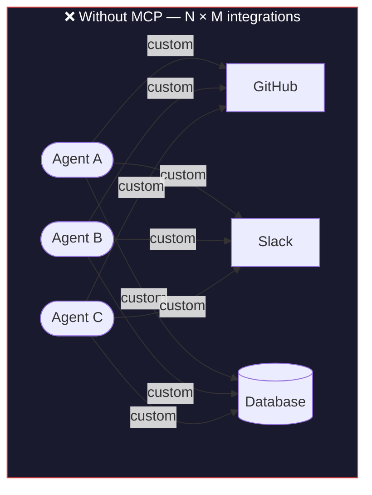
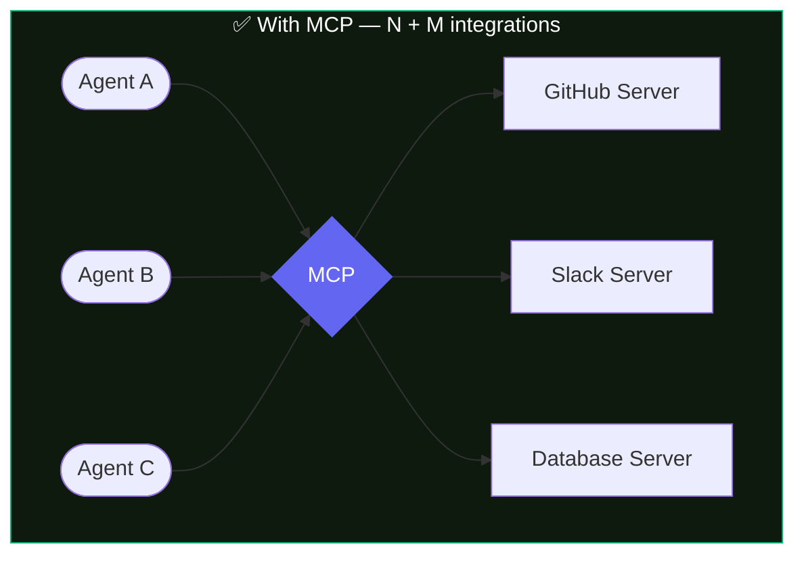
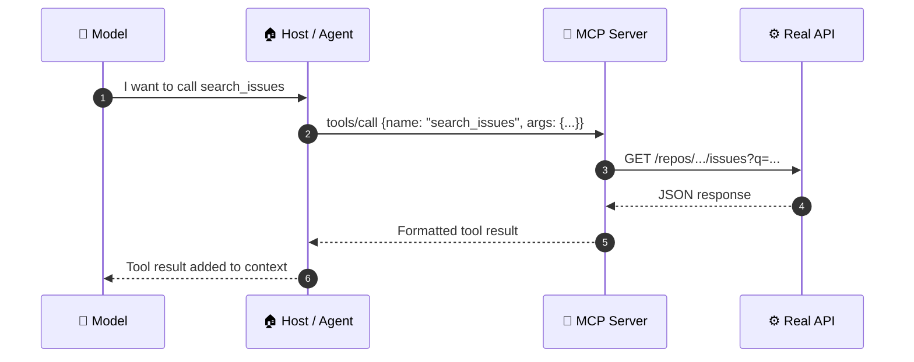
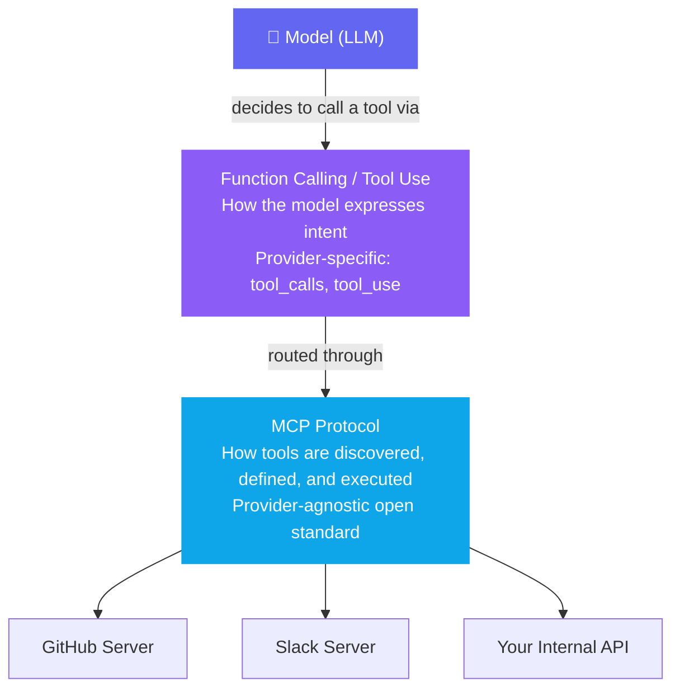

# Module 1 — What MCP Is

Beginner

**Prerequisite:** None &nbsp;·&nbsp; **Spec anchor:** [MCP 2025-11-25](https://modelcontextprotocol.io/specification/2025-11-25/architecture) (normative)

---

## Start with the pain

You are building an AI agent. It needs to query GitHub, post to Slack, read from your database, and call an internal REST API.

Without a standard, you wire each connection by hand — custom auth, custom response parsing, custom error handling — for every combination of agent and tool.

Three agents, four tools: **twelve custom integrations to build and maintain.**

Add a fourth tool, a fourth agent. The lines multiply. Every new combination is another integration to write, test, and break when the upstream API changes.

MCP solves this by replacing the web of direct connections with a common protocol.

Build the GitHub server once. Every MCP-compatible agent can use it. That is the **N+M** model: N agents plus M servers, not N times M integrations.

---

## What MCP actually is

**Model Context Protocol (MCP)** is an open standard for connecting AI applications to external tools and data sources.

Technically: it is a **JSON-RPC 2.0 session protocol** focused on context exchange between a client (inside your agent) and a server (exposing tools and data).

:::note[The official analogy]
Think of MCP like a **USB-C port for AI applications**. Just as USB-C provides a standardized way to connect devices, MCP provides a standardized way to connect AI applications to external systems. — *modelcontextprotocol.io*
:::

The analogy holds: USB-C means your laptop charges from any compatible charger; MCP means your agent can use any compatible server without custom wiring.

:::info[Who governs MCP]
MCP launched in November 2024 as an Anthropic project. In December 2025 it was donated to the **Agentic AI Foundation**, a directed fund under the **Linux Foundation**, co-founded with Block and OpenAI. It is now a multi-company open standard — not any single vendor's protocol.

OpenAI, Google (Gemini), Microsoft (Azure AI Foundry, GitHub Copilot), Cursor, and AWS Bedrock all adopted MCP by early 2026. It is the de facto industry standard for AI tool integration.
:::

---

## How a tool call actually flows

The model never reaches into a tool directly. It expresses intent, and the host routes the call through MCP to the server, which does the real work.

The model only ever sees the tool's **name**, **description**, and **input schema** — never the API behind it. Step 3 is completely invisible to the model.

---

## MCP and function calling are not competitors

This is the most common misconception. They operate at different layers.

| Layer | What it does | Examples |
|---|---|---|
| **Function calling** | Model expresses "call this tool with these args" | `tool_use` (Anthropic), `tool_calls` (OpenAI) |
| **MCP** | Standardizes how tools are defined, discovered, and run | The protocol itself |

In practice, most real systems use both: function calling triggers the intent, MCP handles the execution.

---

## What MCP is not

- **Not a framework** — it defines message shapes and session behavior, not how you build your app.
- **Not middleware** — there is no MCP runtime sitting between your agent and its tools at deploy time.
- **Not a replacement for direct API calls** — sometimes a direct call is simpler. MCP earns its cost when you need reuse, governance, or provider-agnostic portability. (Module 6 covers this decision.)
- **Not magic** — the model still needs well-described tools to pick them correctly. Garbage descriptions produce garbage tool selection.

---

## Spec version note

:::warning[Stateful today, stateless in July 2026]
The current normative spec (2025-11-25) describes MCP as a **stateful session protocol**. A release candidate published May 2026 removes protocol-level sessions, making HTTP transport **stateless**. That RC ships as stable on **July 28, 2026**.

Content in this guide is anchored to **2025-11-25** and noted where the RC changes things. Modules 3, 4, and 8 carry the most affected claims.
:::

---

## Takeaway

MCP is JSON-RPC 2.0 over a session — an open standard that turns N×M custom integrations into N+M reusable connections. Build a server once; any compatible agent uses it. The model picks a tool from a list, and the server does the work. MCP and function calling are complementary layers, not competing approaches.

---

## Sources

| Source | Type | URL |
|---|---|---|
| MCP spec 2025-11-25 · Architecture | **[normative]** | https://modelcontextprotocol.io/specification/2025-11-25/architecture |
| MCP spec 2025-11-25 · Base Protocol | **[normative]** | https://modelcontextprotocol.io/specification/2025-11-25/basic |
| modelcontextprotocol.io introduction | **[official]** | https://modelcontextprotocol.io/introduction |
| Anthropic, Introducing MCP (Nov 2024) | **[official]** | https://www.anthropic.com/news/model-context-protocol |
| Anthropic, Building effective agents | **[official]** | https://www.anthropic.com/news/building-effective-agents |
| 2026-07-28 RC blog post | **[official, provisional]** | https://blog.modelcontextprotocol.io/posts/2026-07-28-release-candidate/ |
| SEP-2567: Sessionless MCP | **[normative-RC]** | https://modelcontextprotocol.io/seps/2567-sessionless-mcp |
