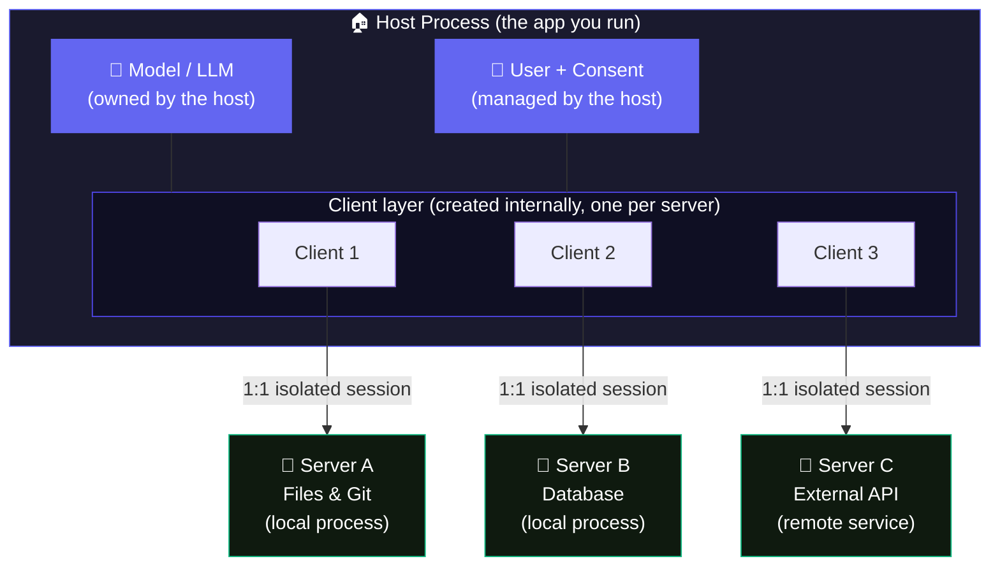
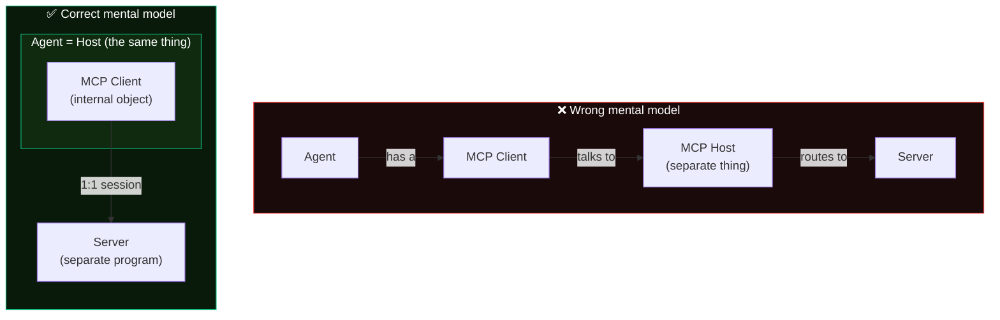
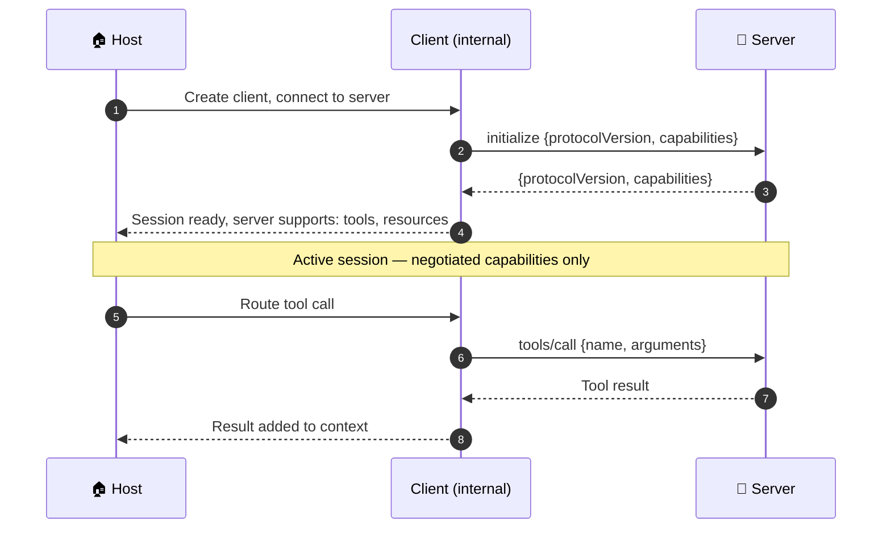

# Module 2 — The Three Roles: Host, Client, Server

Beginner

**Prerequisite:** Module 1 — What MCP Is &nbsp;·&nbsp; **Spec anchor:** [MCP 2025-11-25](https://modelcontextprotocol.io/specification/2025-11-25/architecture) (normative)

---

## The confusion this module fixes

Most office-hours confusion about MCP traces back to three conflated terms: host, client, and server. In web development, "client" means the whole app making requests. In MCP it means one internal connection object. Getting that wrong inverts the entire mental model.

This module nails the definitions once so the rest of the guide makes sense.

---

## The three roles

The MCP spec defines three distinct roles. Here they are in plain language, followed by the exact normative text.

| Role | Plain language | Spec definition |
|---|---|---|
| **Host** | The app you run. Owns the model, the user, and consent. | "The host process acts as the container and coordinator." |
| **Client** | One connection object *inside* the host. Created by the host, not by you. | "Each client is created by the host and maintains an isolated server connection." |
| **Server** | A separate program that exposes capabilities. | "Servers provide specialized context and capabilities." |

### Host

The host is the application the user actually runs. Examples include Claude Desktop, Claude Code, VS Code with Copilot, and any agent you build. The host:

- Creates and manages all client instances
- Controls connection permissions and lifecycle
- Enforces security policies and consent requirements
- Handles user authorization decisions
- Coordinates AI and LLM integration (sampling)
- Aggregates context across all connected servers

The host is the decision-maker. Nothing reaches the model without passing through it.

### Client

A client is a connection object created by the host, one per server. It is not an application, not a process, and not something you configure or deploy separately. You do not write code that "is" a client. The host creates clients internally when it connects to servers.

Each client:

- Establishes one session per server
- Handles protocol negotiation and capability exchange with that server
- Routes protocol messages in both directions
- Maintains the security boundary between servers

**The 1:1 relationship is normative.** The spec states: "A host application creates and manages multiple clients, with each client having a 1:1 relationship with a particular server."

:::note[Local vs. remote servers]
For local servers using STDIO transport, a single server process typically serves exactly one client. Remote servers using Streamable HTTP transport can serve many clients simultaneously — each client still has its own dedicated connection, but multiple client instances from different hosts may connect to the same remote server program.
:::

### Server

A server is a separate program that exposes capabilities. It can run locally on the same machine as the host (launched as a child process via STDIO) or remotely over the network (reached via HTTP). Servers:

- Expose resources, tools, and prompts via MCP primitives
- Operate independently with focused responsibilities
- Can request sampling through their client interface
- Must respect declared security constraints

Servers have no visibility into the conversation history, the model, or what other servers are doing. That information lives entirely in the host.

---

## The containment model

The most important structural insight: clients live *inside* the host. The host is not a middleman you talk to. It is the process that owns everything.

Server A cannot see what Client 2 or Client 3 are doing. Server B cannot read the conversation history. Each server sees only what the host chooses to send through its client.

---

## The wrong mental model vs. the right one

This is the diagram that resolves the most common confusion. "My Docker agent has an MCP client that talks to the MCP host" inverts the architecture completely.

The agent *is* the host. The client is an internal connection object the host creates. There is no separate "MCP Host" process to dial into.

:::warning[The inversion trap]
"My agent has an MCP client that talks to the MCP host" is backwards. The agent contains the host. The host creates the client. The client talks to a server. Reread this until it sticks.
:::

---

## Why "client" trips everyone

In HTTP and browser development, "client" means the whole application making requests. In MCP, the whole application is the **host**. The "client" is a narrow, internal object. Same word, completely different scope.

A useful analogy: in a web browser (the host), each tab that opens a WebSocket connection is like a client. The browser creates and manages those connections. You do not configure or deploy the connections separately. The host owns them.

---

## Agent = Host

For this course, treat **agent** and **host** as synonyms. The running application that owns the model and creates clients is the agent. It is also the host. The spec uses "host" for the architectural role; "agent" is the practical term most developers use. Same thing.

---

## Design principles from the spec

These four principles are normative in the 2025-11-25 spec and explain why the architecture is shaped this way.

**1. Servers should be extremely easy to build.** The host handles complex orchestration. Servers focus on one job. The protocol is intentionally simple so server authors are not burdened with coordination logic.

**2. Servers should be highly composable.** Each server provides focused functionality. Multiple servers combine seamlessly. A host can aggregate context from five servers without those servers knowing about each other.

**3. Servers cannot read the whole conversation or see into other servers.** Full conversation history stays with the host. Each server connection is isolated. Cross-server interactions are controlled by the host, never by the servers themselves.

**4. Features can be added progressively.** The core protocol provides minimal required functionality. Both parties negotiate additional capabilities during initialization and can evolve independently. Backwards compatibility is maintained.

### Capability negotiation

During initialization, the client and server exchange what they support. This is normative:

- Servers declare capabilities: resource subscriptions, tool support, prompt templates
- Clients declare capabilities: sampling support, notification handling
- Both parties must respect declared capabilities for the full session

Nothing is assumed. Everything is declared. A server that does not declare tool support will not receive tool calls.

---

## The isolation guarantee

Server B cannot read Server A's data. Server A cannot read the conversation. Neither server can talk to the other directly. This is not a convention. It is a structural property of the protocol.

The host is the only party with full visibility. It decides what context from Server A to pass to the model, and what the model's intent means for Server B. Servers only see what flows through their own client connection.

This isolation is what makes it safe to connect multiple servers with different trust levels to the same host. A low-trust external API server and a high-trust internal database server can coexist. The host enforces the boundary.

---

## Spec version note

:::info[RC changes transport, not roles]
The 2026-07-28 release candidate removes protocol-level stateful sessions, making HTTP transport stateless. The host, client, and server role definitions are unchanged. The 1:1 client-per-server relationship is unchanged. The design principles are unchanged. The RC is an operational redesign of the transport layer, not a conceptual change to the architecture.
:::

---

## Takeaway

Host = the app (owns model, user, consent, aggregation). Client = one isolated connection object per server, created internally by the host. Server = the separate program exposing capabilities. Agent = host. The host is the boundary enforcer. Servers are isolated from each other and from the conversation by design.

---

## Sources

| Source | Type | URL |
|---|---|---|
| MCP spec 2025-11-25 · Architecture | **[normative]** | https://modelcontextprotocol.io/specification/2025-11-25/architecture |
| MCP spec 2025-11-25 · Architecture · Design Principles | **[normative]** | https://modelcontextprotocol.io/specification/2025-11-25/architecture |
| MCP spec 2025-11-25 · Architecture · Capability Negotiation | **[normative]** | https://modelcontextprotocol.io/specification/2025-11-25/architecture |
| modelcontextprotocol.io · Architecture overview | **[official]** | https://modelcontextprotocol.io/docs/learn/architecture |
| 2026-07-28 RC blog post | **[official, provisional]** | https://blog.modelcontextprotocol.io/posts/2026-07-28-release-candidate/ |
