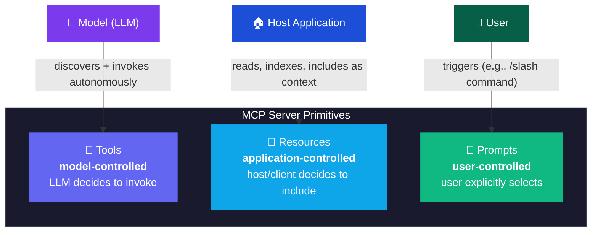
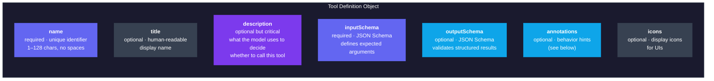
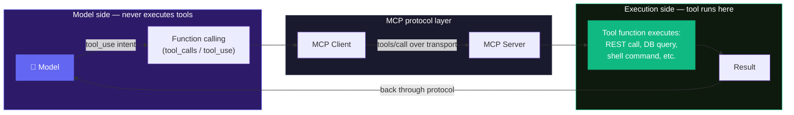

# Module 3 — What a Server Exposes & Where It Runs

<span className="level-badge badge-intermediate">Beginner &rarr; Intermediate</span>

**Prerequisite:** Module 2 — The Three Roles &nbsp;·&nbsp; **Spec anchor:** [MCP 2025-11-25](https://modelcontextprotocol.io/specification/2025-11-25/server/tools) (normative)

:::warning[July 2026 spec change ahead]
The current normative spec (2025-11-25) describes Streamable HTTP as a stateful session protocol requiring an initialize handshake and `MCP-Session-Id`. A release candidate published in May 2026 removes protocol-level sessions, making HTTP transport **stateless**. The final spec ships **July 28, 2026**. Transport and session claims in this module are anchored to 2025-11-25. The RC impact is called out where it matters.
:::

---

## The three primitives — and who controls each

Every MCP server exposes some combination of three primitives. The critical distinction is **who decides when to use each one**.



| Primitive | Who controls it | Protocol messages | Key traits |
|---|---|---|---|
| **Tools** | Model (LLM) | `tools/list`, `tools/call` | Callable functions; model picks autonomously |
| **Resources** | Application / Host | `resources/list`, `resources/read` | Readable data behind a URI; supports subscriptions and URI templates (RFC 6570) |
| **Prompts** | User | `prompts/list`, `prompts/get` | Templates the user explicitly selects; typically exposed as slash commands |

Most servers ship only **tools**. Resources and prompts are less commonly implemented but matter for IDE integrations, document-context servers, and workflow UIs.

:::info[Why the control model matters]
The control model is not a convention — it shapes what the server can safely do without human confirmation. A model-controlled tool that sends email needs extra scrutiny. An application-controlled resource that reads a file is lower risk. Prompts, being user-initiated, are the safest category.
:::

---

## What a tool actually is

A tool is a function the server author writes. It can call a REST API, query a database, run a shell command, or do any computation the server process has permission to do. The model only ever sees the tool's **name**, **description**, and **input schema** — never the implementation behind it.

```
model picks tool → host routes call → client sends tools/call → server executes → result travels back up
```

The separation is total. Step 3 (the actual API call, DB query, or shell command) is invisible to the model. This is what makes MCP a safe boundary: you control what the server exposes; the model cannot reach past it.

---

## Tool definition — fields and what they do

### Required and optional fields

A well-defined tool definition in the 2025-11-25 spec includes these fields:



**`name`** is the unique identifier the client uses in `tools/call`. Names should be between 1 and 128 characters. Only ASCII letters, digits, underscores, hyphens, and dots are recommended. No spaces.

**`description`** is what the model reads to decide whether to call your tool. A vague description produces wrong tool selection. Write it like a precise contract, not marketing copy.

**`inputSchema`** is required and must be a valid JSON Schema object. For tools with no parameters, use `{ "type": "object", "additionalProperties": false }` — the spec recommends this form explicitly.

**`outputSchema`** is optional. When present, servers MUST return structured results that conform to it, and clients SHOULD validate. The result arrives in a `structuredContent` field alongside a text fallback for backward compatibility.

### Behavior hints (annotations)

Annotations are hints the server provides about a tool's behavior. Clients MUST treat them as untrusted unless the server is trusted. The spec establishes cautious defaults: an unannotated tool is assumed potentially destructive.

| Annotation | Default | What it signals |
|---|---|---|
| `readOnlyHint` | `false` | Tool does not modify state |
| `destructiveHint` | `true` | Tool may make destructive changes |
| `idempotentHint` | `false` | Repeated calls with same args have same effect |
| `openWorldHint` | `true` | Tool may interact with unknown external entities |

:::warning[Annotations are hints, not guarantees]
A malicious or buggy server can lie in its annotations. Clients MUST NOT skip confirmation flows or access controls based solely on annotation values unless the server is explicitly trusted. Build your security posture around server trust, not annotation content.
:::

---

## Defining tools in Python — FastMCP and the official SDK

The lowest-boilerplate path to a working MCP server in Python is **FastMCP**. FastMCP 1.0 was incorporated into the official `mcp` Python SDK in 2024 and also continues as a standalone project (`pip install fastmcp`) that powers roughly 70% of MCP servers across all languages as of 2026.

The `@tool` decorator approach generates JSON Schema from Python type hints and Pydantic models automatically:

```python
from fastmcp import FastMCP
from pydantic import BaseModel, Field
from typing import Literal

mcp = FastMCP("weather-server")

class WeatherArgs(BaseModel):
    location: str = Field(description="City name or zip code")
    units: Literal["celsius", "fahrenheit"] = Field(
        default="celsius",
        description="Temperature unit"
    )

@mcp.tool(
    description="Get current weather for a location. Returns temperature and conditions.",
    annotations={"readOnlyHint": True, "openWorldHint": True}
)
def get_weather(args: WeatherArgs) -> dict:
    # Server code calls the real weather API here
    return {"temperature": 22.5, "conditions": "Partly cloudy"}
```

Key practices from this example:

- Use Pydantic models with `Field(description=...)` so every parameter has a description. The model reads these descriptions to fill arguments correctly.
- Use `Literal` types for finite sets of values. This produces an `enum` in the generated schema, preventing the model from inventing values.
- Set `readOnlyHint: True` when the tool does not modify state — this gives clients the information to skip confirmation prompts.
- The description on the `@mcp.tool` decorator becomes the `description` field in the tool definition. Write it precisely.

:::tip[FastMCP vs the official SDK directly]
Use FastMCP when building servers for standard clients (Claude Desktop, Cursor, VS Code Copilot). Use the official `modelcontextprotocol/python-sdk` directly when you need protocol-level control — custom transports, unusual capability negotiation, or handler shapes that FastMCP does not expose. FastMCP wraps the official SDK, so the migration path between the two is straightforward.
:::

---

## Transports — and where the tool actually runs

### The two standard transports

MCP 2025-11-25 defines exactly two standard transports. Clients SHOULD support stdio whenever possible.

```mermaid
graph TB
    subgraph local["Local Deployment — stdio"]
        direction LR
        HC["Host / Client Process"] -->|"stdin (JSON-RPC)"| SP["Server Subprocess"]
        SP -->|"stdout (JSON-RPC)"| HC
        SP -->|"stderr (logs only)"| HC
        SP --> LA["Local API<br/>DB, filesystem,<br/>local process"]
    end

    subgraph remote["Remote Deployment — Streamable HTTP"]
        direction LR
        HC2["Host / Client"] -->|"HTTP POST /mcp"| RS["Remote MCP Server"]
        RS -->|"application/json or SSE stream"| HC2
        RS --> RA["Remote API<br/>cloud service,<br/>internal microservice"]
    end

    style local fill:#0f1a0f,stroke:#10b981,color:#fff
    style remote fill:#1a1a2e,stroke:#6366f1,color:#fff
    style HC fill:#065f46,stroke:#065f46,color:#fff
    style SP fill:#065f46,stroke:#065f46,color:#fff
    style LA fill:#374151,stroke:#374151,color:#fff
    style HC2 fill:#1d4ed8,stroke:#1d4ed8,color:#fff
    style RS fill:#1d4ed8,stroke:#1d4ed8,color:#fff
    style RA fill:#374151,stroke:#374151,color:#fff
```



**stdio transport**

The client launches the MCP server as a subprocess. Messages travel over stdin/stdout as newline-delimited JSON-RPC. The server writes logs to stderr only — nothing non-MCP goes to stdout. This is the simplest transport and the right choice for any server that runs on the same machine as the agent.

**Streamable HTTP transport**

The server runs as a standalone process reachable over the network. The server exposes a single endpoint (e.g., `https://example.com/mcp`) that accepts both POST and GET. POST carries JSON-RPC requests; GET opens an optional SSE stream for server-initiated messages. Streamable HTTP replaces the older HTTP+SSE transport (deprecated in protocol version 2024-11-05).

:::info[HTTP+SSE is deprecated]
The original HTTP+SSE transport from protocol version 2024-11-05 is deprecated. New remote servers should implement Streamable HTTP. The backwards-compatibility guide in the spec explains how to detect old vs. new transports: try a POST first; fall back to a GET for SSE if you get a 404/405.
:::

### Security requirements for Streamable HTTP

When running Streamable HTTP:

- Servers MUST validate the `Origin` header on all incoming connections to prevent DNS rebinding attacks. Return HTTP 403 if the Origin header is present and invalid.
- Servers SHOULD bind to localhost only when running locally, not all interfaces.
- Session IDs (the `MCP-Session-Id` header) MUST be cryptographically secure (a UUID v4, JWT, or cryptographic hash).
- Clients MUST include `MCP-Protocol-Version: 2025-11-25` on all HTTP requests after initialization.

:::note[What the July 2026 RC changes for HTTP transport]
The 2026-07-28 RC removes the `MCP-Session-Id` session handshake entirely. Every request becomes self-contained — client info and capabilities travel in `_meta` on each request rather than being negotiated once at startup. The practical benefit: remote servers can run behind a plain round-robin load balancer with no sticky sessions. The RC also adds `Mcp-Method` and `Mcp-Name` headers so gateways can route without opening the request body. If you are targeting post-July 2026 deployments, design your server without session state.
:::

---

## Where the tool runs

Tools execute inside the server process, not inside the model. Where the server runs determines where the tool runs.



The transport determines where "where the server runs" is:

| Transport | Server location | Tool executes |
|---|---|---|
| stdio | Local subprocess on the same machine as the agent | Locally, with access to local filesystem, processes, and APIs |
| Streamable HTTP | Any reachable network endpoint | Wherever that server is deployed — a container, a VM, a serverless function |

Co-locating the agent and server is one deployment pattern, not a requirement. Different containers, pods, or hosts are all valid. The protocol is transport-agnostic and does not assume physical proximity.

---

## Local vs remote design principles

Keep MCP servers **thin and mostly stateless**. A server should be an interface layer over an internal system — not a stateful application tier. This makes servers easier to scale, deploy, and replace.

A few practical implications:

- If your server needs to maintain state across calls, store it externally (a database, a cache) rather than in process memory. This matters especially with Streamable HTTP where multiple instances may handle requests.
- The agent and server do not need to be co-hosted. Co-hosting is a valid choice for simplicity; separation is a valid choice for security isolation, scaling, or organizational boundaries.
- Prefer a small surface area. Expose only the tools a client needs. A server with fifty tools is harder for the model to navigate than a server with five precise ones.

---

## Takeaway

MCP servers expose three primitives with distinct control models: tools (model decides), resources (application decides), prompts (user decides). Most servers ship tools only. A well-defined tool has a precise description, a complete `inputSchema`, accurate annotations, and an optional `outputSchema` for structured results. Use FastMCP or the official Python SDK to generate schemas from type hints. Choose stdio for local deployments, Streamable HTTP for remote. Tools execute on the server, never inside the model. The July 2026 spec removes HTTP session state, so design remote servers to be stateless now.

---

## Sources

| Source | Type | URL |
|---|---|---|
| MCP spec 2025-11-25 · Tools | **[normative]** | https://modelcontextprotocol.io/specification/2025-11-25/server/tools |
| MCP spec 2025-11-25 · Resources | **[normative]** | https://modelcontextprotocol.io/specification/2025-11-25/server/resources |
| MCP spec 2025-11-25 · Prompts | **[normative]** | https://modelcontextprotocol.io/specification/2025-11-25/server/prompts |
| MCP spec 2025-11-25 · Transports | **[normative]** | https://modelcontextprotocol.io/specification/2025-11-25/basic/transports |
| MCP Python SDK (official) | **[official]** | https://github.com/modelcontextprotocol/python-sdk |
| FastMCP documentation | **[ecosystem]** | https://gofastmcp.com/getting-started/welcome |
| 2026-07-28 RC blog post | **[official, provisional]** | https://blog.modelcontextprotocol.io/posts/2026-07-28-release-candidate/ |
