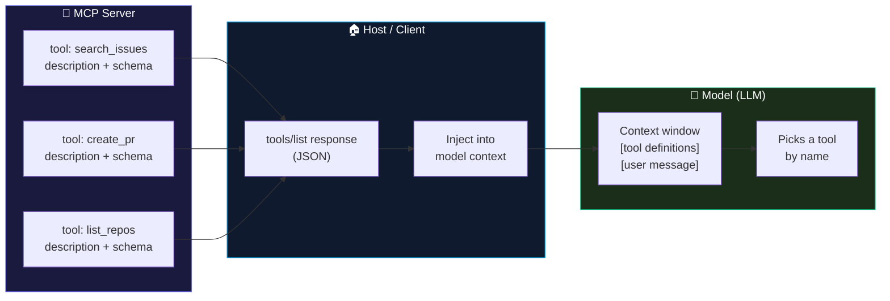
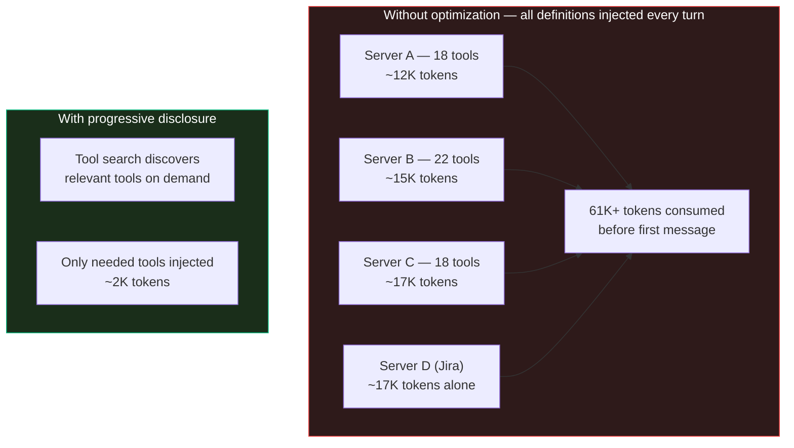

# Module 4 — How an Agent Uses a Server

<span className="level-badge badge-intermediate">Intermediate</span>

**Prerequisite:** Module 3 — What a Server Exposes &nbsp;·&nbsp; **Spec anchor:** [MCP 2025-11-25](https://modelcontextprotocol.io/specification/2025-11-25/basic/lifecycle) (normative)

---

## The problem this module solves

You wired up an MCP server. Your agent has it configured. But the agent keeps calling a shell command it already knows instead of your tool, or acts like the server doesn't exist.

That is not a wiring problem. It is a tool-selection problem, and it starts with understanding exactly how the agent learns about a server in the first place.

---

## The lifecycle: handshake, operation, shutdown

Before any tool can be called, the client and server run a structured handshake. The spec defines three phases: **Initialization**, **Operation**, and **Shutdown**.

```mermaid
sequenceDiagram
  autonumber
  participant C as 🏠 Client (Host)
  participant S as 🔌 MCP Server

  rect rgb(15, 30, 50)
    note over C,S: Phase 1 — Initialization
    C->>+S: initialize {protocolVersion, capabilities, clientInfo}
    S-->>C: initialize response {protocolVersion, capabilities, serverInfo}
    C--)S: notifications/initialized
  end

  rect rgb(15, 40, 20)
    note over C,S: Phase 2 — Operation
    C->>S: tools/list
    S-->>C: [{name, description, inputSchema}, ...]
    C->>S: tools/call {name, arguments}
    S-->>C: tool result
  end

  rect rgb(40, 20, 20)
    note over C,S: Phase 3 — Shutdown
    C--)S: close transport
    deactivate S
  end
```



### Normative rules for initialization

The initialization phase carries several hard requirements from the spec:

- The `initialize` request **MUST** be the first interaction. **[normative]**
- The `initialize` request **MUST NOT** be part of a JSON-RPC batch. **[normative]**
- After the server responds, the client **MUST** send `notifications/initialized` before any other requests. **[normative]**
- Parties **MUST NOT** use capabilities that were not successfully negotiated. **[normative]**

### Version negotiation

The client sends the latest protocol version it supports. If the server supports it, it echoes the same version. If not, it responds with its own latest supported version. The client **SHOULD** disconnect if it cannot support the server's offered version. **[normative]**

### Capability negotiation

Capabilities declare which optional protocol features each side supports. The server uses the `tools.listChanged` sub-capability to signal that it can push dynamic tool updates.

| Side | Key capabilities |
|---|---|
| Client | `roots`, `sampling`, `elicitation`, `tasks` |
| Server | `tools`, `resources`, `prompts`, `logging`, `completions`, `tasks` |

:::warning[RC caveat: July 2026 removes the handshake for HTTP]
The 2026-07-28 release candidate makes MCP **stateless** for HTTP transports: the `initialize` / `notifications/initialized` handshake is removed entirely (SEP-2575). Each request will carry its own protocol version and client identity in a `_meta` object. Server capability discovery moves to a new `server/discover` method. The stdio transport retains the handshake. Until the RC ships as stable on July 28, 2026, the handshake described above is normative.
:::

---

## Discovery and injection: the key mechanism

This is the mechanism that explains the "agent ignores the MCP" problem.

After the handshake completes, the host calls `tools/list` (and optionally `resources/list` and `prompts/list`). The server responds with each tool's `name`, `description`, and `inputSchema`. The host then places those definitions into the model's context as the tools available for the current turn.



**The model never communicates with the server directly.** It sees only the injected list, picks a tool by name, and the host routes the `tools/call` back to the server. The model's entire knowledge of a server is the names, descriptions, and schemas the host fetched.

This is why wording in tool descriptions matters so much. The model picks from text.

### Schema ownership vs. capability negotiation

Two concepts that frequently get confused:

- **Tool schemas are server-owned and uniform per tool.** Every client that connects to a server sees the same `inputSchema` for a given tool. The client config does not define the schema. **[normative]**
- **Capability negotiation is per-session.** It controls which protocol features are active, not what a given tool's schema looks like.

A server may return a different tool *list* to different sessions based on authenticated identity, but that is the server deciding, not the client config.

### Dynamic tool updates

When a server's tool list changes at runtime, it can push a notification if it declared the `listChanged` sub-capability:

```json
{
  "jsonrpc": "2.0",
  "method": "notifications/tools/list_changed"
}
```

The client receives the notification and re-calls `tools/list` to get the updated list. The `tools.listChanged: true` flag in the server's initialize response is required for this to be expected behavior. **[normative]**

---

## Context bloat: why tool injection is expensive

Tool definitions are injected on every turn. With many servers or tools with verbose schemas, this cost compounds fast.



Anthropic's tool search work found that a five-server setup with 58 tools consumed approximately 55K tokens before the conversation started. Configurations with more servers have pushed tool definitions alone to **134K tokens** — roughly half of a 200K-token context window, consumed before you ask a single question.

The mitigation is progressive disclosure: present tools as code the model loads on demand, rather than injecting all definitions upfront. Anthropic's code execution with MCP pattern reported a reduction **from 150,000 tokens to 2,000 tokens — a 98.7% saving**. The spec does not mandate this pattern ("implementation is left as an exercise for the reader"), but it is a documented official engineering approach.

:::info[Token limit in Claude Code]
For Claude Code specifically, tool responses are restricted to **25,000 tokens by default**. This is host-side enforcement of token efficiency, independent of the spec. — *Anthropic, "Writing effective tools for AI agents"*
:::

---

## Writing tools the model will actually pick

The model picks tools from text descriptions. The quality of those descriptions directly determines tool selection accuracy.

Anthropic published five principles for writing effective tools at `https://www.anthropic.com/engineering/writing-tools-for-agents`.

**1. Build the right tools.** Do not wrap every API endpoint. More tools do not lead to better outcomes. Focus on high-impact, frequently needed workflows. **[official]**

**2. Namespace tool names.** When you have tools from multiple sources, prefixes prevent collisions: `asana_search` and `jira_search` are unambiguous; `search` alone is not. **[official]**

**3. Return meaningful, high-signal context.** Prefer semantic names and human-readable output over raw identifiers and cryptic codes. The model reads the output and decides what to do next. **[official]**

**4. Optimize for token efficiency.** Implement pagination, filtering, and truncation with sensible defaults. Agents do not have the same tolerance for verbose responses that traditional software does. **[official]**

**5. Prompt-engineer tool descriptions.** Write descriptions as you would explain the tool to a new hire. Use unambiguous parameter names (`user_id`, not `user`). Small refinements can produce dramatic improvements in tool selection accuracy. **[official]**

---

## Fixing "my agent ignores the MCP"

Tool selection is model-driven from the injected descriptions. The model will pick a shell command it was trained on over your custom tool if your tool's description does not make the right choice obvious. Four fixes address the root causes:

### Fix 1: Sharpen the description

Apply principle 5 above. The description is the tool's only voice inside the model's context. Vague descriptions produce vague selection.

### Fix 2: Steer with custom instructions

Short, persistent instructions sent with every request can direct the agent to prefer your tools. These are host-side directives, separate from the tool descriptions themselves.

> GitHub Copilot's custom instruction support is one example of this pattern. — *GitHub Docs, "Add custom instructions for Copilot"*

### Fix 3: Reduce the toolset

Fewer tools available means fewer opportunities for the wrong choice.

> "Fewer tools means better tool selection accuracy and fewer errors." — *GitHub Docs, "About Model Context Protocol (MCP)"*

Enable only the tools the agent needs for the current task. This also reduces context bloat.

### Fix 4: Remove the fallback

If the agent can reach a shell or a raw API alongside your MCP tool, it will use whichever it finds easier. Constrain what else the agent can reach. Module 5 covers server configuration; Module 8 covers access controls.

---

## What changes when the 2026-07-28 RC lands

When the stateless RC ships for HTTP transports, the initialization handshake disappears. The practical implications:

- **Discovery still happens**, but through a `server/discover` method rather than `initialize`.
- **`tools/list` calls remain.** The discovery-to-injection mechanism described in this module is unchanged.
- **Tool descriptions still drive selection.** Nothing in the RC changes how models pick tools.
- **`notifications/tools/list_changed`** will need adaptation for HTTP: there is no persistent session to push into; the RC's caching model (`ttlMs`) replaces push notifications. stdio retains push behavior.

---

## Takeaway

The host discovers tools via `tools/list` and injects their definitions into the model's context. The model picks from that list by name. Schema is server-owned and uniform. Per-client differences are handled through capability negotiation, not schema variation. "Forgetting" to use the MCP is a tool-selection problem: better descriptions, focused toolsets, custom instructions, and removed fallbacks are the fixes. Context bloat is real (134K tokens before optimization has been observed in practice) and is mitigated by progressive disclosure.

---

## Sources

| Source | Type | URL |
|---|---|---|
| MCP spec 2025-11-25 · Lifecycle | **[normative]** | https://modelcontextprotocol.io/specification/2025-11-25/basic/lifecycle |
| MCP spec 2025-11-25 · Tools | **[normative]** | https://modelcontextprotocol.io/specification/2025-11-25/server/tools |
| Anthropic, Writing effective tools for AI agents (Sep 2025) | **[official]** | https://www.anthropic.com/engineering/writing-tools-for-agents |
| Anthropic, Code execution with MCP (Nov 2025) | **[official]** | https://www.anthropic.com/engineering/code-execution-with-mcp |
| Anthropic, Advanced tool use — Tool Search | **[official]** | https://www.anthropic.com/engineering/advanced-tool-use |
| GitHub Docs, About Model Context Protocol (MCP) | **[official]** | https://docs.github.com/en/copilot/concepts/context/mcp |
| GitHub Docs, Add custom instructions for Copilot | **[official]** | https://docs.github.com/en/copilot/how-tos/configure-custom-instructions |
| MCP 2026-07-28 release candidate | **[official, provisional]** | https://blog.modelcontextprotocol.io/posts/2026-07-28-release-candidate/ |
| SEP-2575: Make MCP Stateless | **[normative-RC]** | https://github.com/modelcontextprotocol/modelcontextprotocol/pull/2575 |
