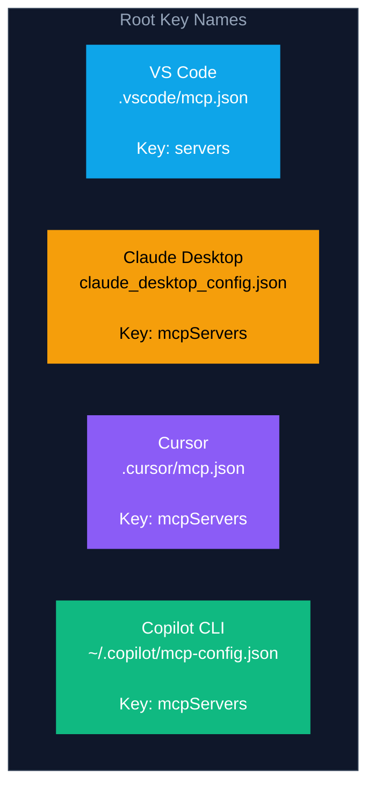

# Module 5 — Configuring Servers Across Your Tools

<span className="level-badge badge-intermediate">Intermediate</span>

**Prerequisite:** Module 4 — How an Agent Uses a Server &nbsp;·&nbsp; **Note:** Config formats are per-client — verify against each tool's docs

---

## What this module covers

You know what MCP servers do. Now you need to wire them into whichever tool you actually use. This module covers:

- Where each major tool looks for its MCP config and what key name it expects
- The `servers` vs `mcpServers` naming split that silently breaks copied configs
- How to reference secrets without hardcoding them
- The difference between *declaring* a server (config) and *steering* the model (instructions)
- Enterprise policy controls for GitHub Copilot

:::warning[VS Code uses `servers`, not `mcpServers`]
Every other major MCP client uses `mcpServers` as the root key. VS Code uses `servers`. If you copy a config from Claude Desktop or Cursor into `.vscode/mcp.json` without renaming this key, the servers will silently fail to load. There is no error message. This trips nearly everyone the first time.
:::

---

## What the config actually does

The config file tells your tool's **host** (VS Code, Claude Desktop, Cursor) which servers exist and how to reach them. The host reads the list at startup, creates one MCP client per entry, connects to each server, and fetches the tools list. From that point on, those tools are visible to the model in every session.

You declare **servers**, never clients. Clients are created implicitly by the host. Per server, you specify either:

- **stdio transport:** a `command` and `args` — the host launches a local process and communicates over stdin/stdout
- **http transport:** a `url` — the host connects to a running remote server over Streamable HTTP

:::info[SSE is deprecated]
An older transport type, `"type": "sse"` (HTTP with Server-Sent Events), was deprecated in the MCP spec update from March 2025. New integrations should use `"type": "http"` (Streamable HTTP) for remote servers. GitHub Copilot CLI still lists SSE as supported for backward compatibility, but marks it as deprecated. For local development, `stdio` remains the most common and most interoperable choice.
:::

---

## Config file locations and key names

The single most important thing to know before looking at JSON: each tool uses a different file path and a different root key name.



| Tool | Config file | Root key | Scope options |
|---|---|---|---|
| **VS Code** | `.vscode/mcp.json` (workspace) or user profile | `servers` | Workspace or user |
| **Claude Desktop** | `~/Library/Application Support/Claude/claude_desktop_config.json` (macOS) · `%APPDATA%\Claude\claude_desktop_config.json` (Windows) | `mcpServers` | Global only |
| **Cursor** | `.cursor/mcp.json` (project) or `~/.cursor/mcp.json` (global) | `mcpServers` | Project or global |
| **Copilot CLI** | `~/.copilot/mcp-config.json` | `mcpServers` | Global only |

---

## Config examples for each tool

### VS Code — `.vscode/mcp.json`

VS Code uses `"servers"` (not `"mcpServers"`). The `inputs` block is how VS Code handles secrets securely — it prompts the user on first use rather than reading an env var directly.

```json
{
  "servers": {
    "github": {
      "type": "http",
      "url": "https://api.githubcopilot.com/mcp"
    },
    "playwright": {
      "type": "stdio",
      "command": "npx",
      "args": ["-y", "@microsoft/mcp-server-playwright"]
    },
    "internal-api": {
      "type": "http",
      "url": "https://mcp.internal.example.com",
      "headers": {
        "Authorization": "Bearer ${input:internal-api-key}"
      }
    }
  },
  "inputs": [
    {
      "id": "internal-api-key",
      "type": "promptString",
      "description": "Internal API key",
      "password": true
    }
  ]
}
```

:::note[VS Code Agent mode required]
MCP tools in VS Code only appear in **Agent mode** (Copilot Chat). If you test in Ask mode or Edit mode, the tools will not show up even when the config is correct.
:::

### Claude Desktop — `claude_desktop_config.json`

Claude Desktop is the most common first entry point for new MCP users. It only supports stdio servers today — remote HTTP servers are not yet supported in Claude Desktop. Secrets go in the `env` block; reference your shell environment variables directly.

```json
{
  "mcpServers": {
    "filesystem": {
      "command": "npx",
      "args": [
        "-y",
        "@modelcontextprotocol/server-filesystem",
        "/Users/username/Desktop",
        "/Users/username/Documents"
      ]
    },
    "github": {
      "command": "npx",
      "args": ["-y", "@modelcontextprotocol/server-github"],
      "env": {
        "GITHUB_PERSONAL_ACCESS_TOKEN": "${GITHUB_PERSONAL_ACCESS_TOKEN}"
      }
    }
  }
}
```

After saving the config, restart Claude Desktop completely. A successful connection shows an MCP indicator in the lower right of the input box.

**Log locations for debugging:**
- macOS: `~/Library/Logs/Claude/mcp*.log`
- Windows: `%APPDATA%\Claude\logs\mcp*.log`

### Cursor — `.cursor/mcp.json`

Cursor uses `mcpServers` and supports both stdio and remote servers. Project-level config (`.cursor/mcp.json`) takes precedence over global (`~/.cursor/mcp.json`).

```json
{
  "mcpServers": {
    "filesystem": {
      "command": "npx",
      "args": ["-y", "@modelcontextprotocol/server-filesystem", "/path/to/folder"]
    },
    "notion": {
      "url": "https://mcp.notion.com/mcp",
      "headers": {
        "Authorization": "Bearer ${NOTION_API_KEY}"
      }
    }
  }
}
```

### GitHub Copilot CLI — `~/.copilot/mcp-config.json`

Copilot CLI supports three transport types. Use `"type": "local"` for stdio (same as the standard `stdio` type — the docs note this name is compatible with VS Code and the Copilot cloud agent). Avoid `"type": "sse"` for new servers; it is deprecated.

```json
{
  "mcpServers": {
    "playwright": {
      "type": "local",
      "command": "npx",
      "args": ["@playwright/mcp@latest"],
      "env": {},
      "tools": ["*"]
    },
    "context7": {
      "type": "http",
      "url": "https://mcp.context7.com/mcp",
      "headers": {
        "Authorization": "Bearer ${CONTEXT7_API_KEY}"
      },
      "tools": ["*"]
    }
  }
}
```

You can also add servers via the Copilot CLI interactive command: `gh copilot mcp add`.

---

## Secrets: never hardcode, always reference

Hardcoding credentials in config files creates two problems: the file may be committed to source control, and it is readable by anyone with filesystem access. All four tools support referencing secrets by name rather than value.

The pattern is consistent — embed a reference like `${MY_SECRET}` in a string value, and the host resolves it at runtime:

```json
"env": {
  "GITHUB_PERSONAL_ACCESS_TOKEN": "${GITHUB_PERSONAL_ACCESS_TOKEN}"
}
```

or in headers:

```json
"headers": {
  "Authorization": "Bearer ${GITHUB_PERSONAL_ACCESS_TOKEN}"
}
```

VS Code extends this further with the `inputs` block (shown above), which stores values in VS Code's secure credential store after first prompt — preferable to relying on shell environment state.

:::tip[Commit `.vscode/mcp.json` safely]
If your config only uses `${input:...}` or `${ENV_VAR}` references and never hardcoded values, the file is safe to commit. Team members get the same server list; each person supplies their own credentials on first use.
:::

---

## Declare vs steer — the distinction that matters

This is the second conceptual trap after the `servers`/`mcpServers` split.


**Declare in the MCP config.** This is the only place servers become known to the model. Listing a server in `copilot-instructions.md` or `AGENTS.md` does not register it — the host never sees that file at connection time.

**Steer in instructions.** Once a server is declared and its tools are injected into context, you use `copilot-instructions.md`, `AGENTS.md`, or a system prompt to tell the model *when* and *how* to use those tools.

A practical example with two servers declared:

```json
{
  "mcpServers": {
    "infosec-server": {
      "type": "http",
      "url": "https://mcp.security.internal/mcp"
    },
    "customer-server": {
      "type": "http",
      "url": "https://mcp.crm.internal/mcp"
    }
  }
}
```

And in `AGENTS.md` (steering, not declaring):

```markdown
Use the infosec-server tools first for any request involving credentials,
secrets, or permissions. Use the customer-server tools for customer data
lookups. Do not mix data from both servers in a single response unless
explicitly asked.
```

The model learns what the servers expose from the tool descriptions injected at startup. The instructions layer tells it when to reach for them.

---

## Portability: conceptually yes, literally no

The JSON shape is similar enough across tools that copying configs is tempting. In practice, three things break:

1. **The key name.** VS Code requires `servers`; everyone else uses `mcpServers`. A copied config loads no servers and gives no error.

2. **The file location.** Each tool has its own path. A file in the right place for Cursor (`.cursor/mcp.json`) is invisible to VS Code (`.vscode/mcp.json`).

3. **The transport type names.** Copilot CLI uses `"type": "local"` for what other tools call `"type": "stdio"`. Mapping: `local` in Copilot CLI = `stdio` everywhere else.

When moving a config between tools, a safe checklist:
- Rename `mcpServers` to `servers` (or the reverse) as needed
- Move the file to the correct path for the target tool
- Replace `"type": "local"` with `"type": "stdio"` or vice versa
- Replace `"type": "sse"` with `"type": "http"` for any remote server

---

## Enterprise controls (GitHub Copilot)

For organizations with Copilot Business or Copilot Enterprise subscriptions, MCP access is governed by an org-level policy called "MCP servers in Copilot." This policy is **disabled by default** — users cannot add MCP servers until an admin enables it.

Admins can configure:
- **Allow all servers** — any server users configure is permitted
- **Registry only** — servers must be listed in an approved registry URL

This policy applies only to Copilot Business and Enterprise subscribers. Copilot Free, Pro, Pro+, and Max users are not subject to organizational MCP policy.

---

## Trust and local server safety

Local stdio servers run as child processes under your user account. They inherit your filesystem permissions and can execute arbitrary code. Before adding any stdio server:

- Verify the package source and publisher
- Review what the server claims to expose
- Avoid servers that request broad filesystem or network access unless the scope is justified

VS Code surfaces a trust prompt for new MCP servers and supports an "MCP: Reset Trust" command to revoke access. Claude Desktop requires manual config edits to remove a server.

---

## Takeaway

Declare servers in the per-client MCP config file using the correct root key for that tool (`servers` for VS Code, `mcpServers` everywhere else). Reference secrets via env vars or input variables — never hardcode. Use `AGENTS.md` or `copilot-instructions.md` to steer when the model reaches for tools, not to register them. For enterprise Copilot deployments, the MCP policy is off by default and requires admin enablement.

---

## Sources

| Source | Type | URL |
|---|---|---|
| VS Code Docs, Add and manage MCP servers | **[official]** | https://code.visualstudio.com/docs/copilot/chat/mcp-servers |
| VS Code Docs, MCP configuration reference | **[official]** | https://code.visualstudio.com/docs/agents/reference/mcp-configuration |
| GitHub Docs, Adding MCP servers for Copilot CLI | **[official]** | https://docs.github.com/en/copilot/how-tos/copilot-cli/customize-copilot/add-mcp-servers |
| GitHub Docs, About MCP | **[official]** | https://docs.github.com/en/copilot/concepts/context/mcp |
| GitHub MCP server install (Copilot CLI) | **[official]** | https://github.com/github/github-mcp-server/blob/main/docs/installation-guides/install-copilot-cli.md |
| MCP quickstart — Claude Desktop | **[official]** | https://modelcontextprotocol.io/quickstart/user |
| Cursor Docs, MCP | **[official]** | https://cursor.com/docs/context/mcp |
| MCP spec 2025-03-26, Transports | **[normative]** | https://modelcontextprotocol.io/specification/2025-03-26/basic/transports |
