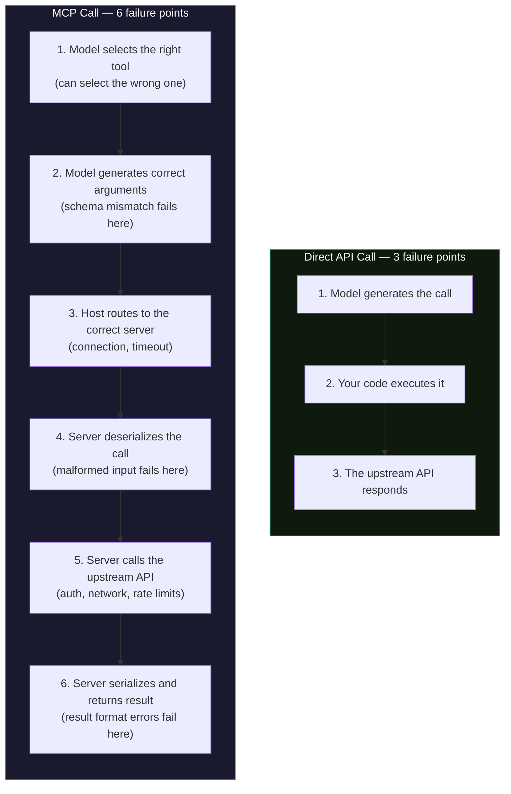
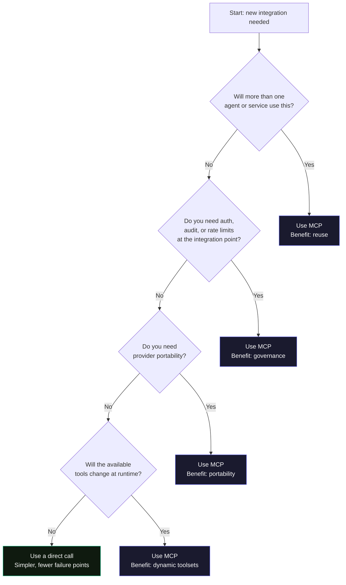

# Module 6 — When to Use MCP, and When Not To

Intermediate

**Prerequisite:** Module 5 — Configuring Servers &nbsp;·&nbsp; **Note:** Decision criteria are ecosystem consensus — not official spec

---

## The decision is a design choice, not a default

MCP is not the right tool for every integration. The question is not "could I wrap this in an MCP server?" (the answer is always yes) but rather "does this integration earn the cost of the protocol?"

That cost is real: an extra process boundary, a tool-selection step the model can get wrong, added latency on every call, and context window tokens consumed by tool schemas before a single word of your user's message is processed.

Pay that cost when the benefits (reuse, governance, provider portability, runtime-changing toolsets) outweigh it. Skip it when they do not.

---

## MCP and function calling: complementary, not competing

Before reaching the decision, one confusion needs clearing up. MCP and function calling operate at different layers. They are not alternatives to each other.

- **Function calling** is how the model expresses intent: "I want to call `search_issues` with these arguments." The schema is provider-specific: `tool_use` in Anthropic, `tool_calls` in OpenAI.
- **MCP** is how that intent gets executed: it standardizes tool discovery, definition, and invocation across providers.

In a real system, function calling triggers the intent, MCP handles the execution. Choosing between MCP and a direct call is a different question from choosing whether to use function calling.

---

## What the extra hop actually costs

This is the part most MCP documentation skips. Every call through MCP adds failure points that a direct API call does not have.

The most operationally painful extra failure point is step 1: tool selection. A model with 3 tools almost always picks the right one. A model exposed to 30 tools from three different MCP servers is choosing from a much noisier list. Research published in early 2026 measured this directly: with 20 tools, large models score near-perfect accuracy. At 107 tools in the context, the same models fail completely.

:::warning[The context bloat reality]
Three active MCP servers (GitHub, a browser tool, and an IDE integration) consumed 143K tokens of tool definitions on a 200K-token model in a measured 2026 study. That leaves 57K tokens for reasoning, memory, and the user's actual task. Tool schemas are not free. Every server you connect costs context before you get any benefit.
:::

Each round-trip through an MCP server also adds 200-400ms of latency. An agent making four sequential tool calls pays that penalty four times. For interactive workflows, that accumulates.

None of this means MCP is bad. It means you should add it when the benefits are worth those costs.

---

## Use a direct call when...

A direct call (your code calls the API, the model only generates arguments) is the right choice in these situations:

- **One API, one app, you own it.** No other agent or service will ever need this integration. Build it directly.
- **Rapid prototype or single-provider deployment.** The overhead of standing up a server process is not justified before you know the integration will survive.
- **Performance-critical path.** Data pipelines, real-time event processing, and financial transaction flows often need deterministic behavior and minimal latency. The extra hop and the model's tool selection step introduce variance that compliance teams and SLOs will not accept.
- **Trusted internal tool with no governance requirement.** If there is no reason to intercept the call (no auth delegation, no audit requirement, no rate limits to enforce), there is no reason to add a layer that enables those things.

:::info[Start here]
The 2026 practitioner consensus that emerged from the MCP Dev Summit is explicit: every system should start with a direct tool function. One agent, one team, no reuse case, no governance requirement. Add MCP when you outgrow that.
:::

A direct call has fewer moving parts, one fewer process to monitor, and no tool-selection failure mode. It is easier to debug, easier to test, and easier to reason about.

---

## Use MCP when...

Add MCP when at least one of these is true:

**Reuse across agents or clients.** If two or more agents need the same integration, building it as an MCP server means building it once. The N+M model (Module 1) only applies when you actually have multiple consumers.

**Provider-agnostic portability.** The same MCP server works with Claude, GPT-4o, Gemini, or any other MCP-compatible host. If you expect to swap the underlying model or run the same agent on multiple providers, MCP avoids rewiring the tools every time.

**Governance at the integration point.** An MCP server is a single interception point. Auth, audit logging, per-user access controls, and rate limits all go here, once, rather than being re-implemented in every consumer. Modules 7 through 9 cover this pattern in detail.

**Runtime-changing toolsets.** The `tools/list_changed` notification lets a server update the available tools during a session. Direct calls cannot do this.

**Team-shared or org-wide tools.** When a database connector, a ticketing system integration, or an internal knowledge base needs to be available to an entire team or organization, MCP servers become the reusable infrastructure layer. Build once, govern centrally, update in one place.

---

## The decision flowchart

If you reach the bottom left (one consumer, no governance need, no portability need, no dynamic tools), use a direct call. If any branch sends you right, the benefits of MCP justify its cost.

---

## Decision cheat sheet

| Situation | Direct call | MCP |
|---|---|---|
| One known API, one app, you own it | Yes | — |
| Same integration reused by several agents | — | Yes |
| Need audit, per-user access, or rate limits | — | Yes |
| Internal or legacy system, many consumers | — | Yes (Module 9) |
| Quick prototype, single endpoint | Yes | — |
| Want to swap models or providers freely | — | Yes |
| Performance-critical, deterministic path | Yes | — |
| Compliance workflow requiring exact repeatability | Yes | — |
| Tools that change during a session | — | Yes |
| Under 3 integrations, one team | Yes | — |

---

## The "everything becomes a server" anti-pattern

The 2026 MCP ecosystem produced a clear signal: the most common adoption mistake is wrapping every capability in an MCP server before understanding whether the protocol buys anything.

The test is not "can I put this in a server?" Everything can be. The test is "does this capability need an independent process boundary, reusable governance, or provider portability?" Most capabilities, especially in early-stage systems, do not.

One concrete example circulated widely in early 2026: a team implemented a full MCP server for a Google Workspace CLI integration, shipped it, and then deleted all 1,151 lines of it two days later after discovering that a large-scale API surface with hundreds of endpoints was architecturally mismatched with MCP's tool-list model. For large API surfaces, CLI-first or direct calls are the proven pattern. MCP is excellent for small-to-medium tool sets, and the emerging 2026 practitioner consensus puts the useful ceiling around 50 tools per server.

:::note[The signal]
Every token spent on tool schemas and protocol overhead is a token not available for reasoning. Adding MCP servers without clear benefit does not just add complexity. It actively degrades the model's ability to think.
:::

The right sequence is:

1. Start with a direct call.
2. When a second consumer appears, evaluate whether to extract to a server.
3. When governance becomes a requirement, add it at the server boundary.
4. When provider portability is needed, the server is already in place.

Build up to MCP. Do not start there.

---

## What about the "3+ integrations" threshold?

Module 10 (enterprise adoption) references a heuristic of three or more AI-connected integrations as a useful signal for when MCP investment starts to pay off. That threshold holds in 2026. With two integrations, the governance and reuse benefits are marginal; at three or more, the N+M savings become concrete.

But the threshold is a heuristic, not a rule. A single integration that handles auth delegation for regulated data may justify an MCP server immediately. Three integrations that are all internal, single-consumer, and trivial may still be better served by direct calls.

The real criteria are the flowchart branches above. The "3+" threshold is a smell test: if you are below it and have no governance or portability need, the answer is almost certainly a direct call.

---

## Connecting to Modules 7 through 9

Modules 7-9 cover registries, gateways, auth, and enterprise patterns that only make sense when you are already using MCP. If you have decided a direct call is appropriate, those modules are not relevant to that integration. If you have decided MCP is appropriate, those modules explain how to get full value from that choice.

:::tip[The flow]
Module 6 decides whether to use MCP. Module 7 covers how to discover and manage servers at scale. Module 8 covers auth and security at the server boundary. Module 9 covers wrapping legacy systems with MCP for enterprise access.
:::

---

## Takeaway

A direct call has fewer failure points, lower latency, and less context overhead. It earns its place when one app owns one integration with no reuse or governance need.

MCP earns its extra complexity when you need reuse across multiple agents, governance at a single interception point, provider-agnostic portability, or runtime-changing tool sets.

Start with a direct call. Add MCP when you outgrow it.

---

## Sources

| Source | Type | URL |
|---|---|---|
| Anthropic, Introducing MCP (Nov 2024) | **[official]** | https://www.anthropic.com/news/model-context-protocol |
| Anthropic, Writing effective tools for AI agents (2026) | **[official]** | https://www.anthropic.com/engineering/writing-tools-for-agents |
| MCP Dev Summit North America 2026, AAIF recap | **[official]** | https://aaif.io/blog/mcp-is-now-enterprise-infrastructure-everything-that-happened-at-mcp-dev-summit-north-america-2026/ |
| Portkey, MCP vs Function Calling | **[ecosystem]** | https://portkey.ai/blog/mcp-vs-function-calling |
| "Not Everything Needs MCP, Part 2" (dev.to, March 2026) | **[ecosystem]** | https://dev.to/gys/not-everything-needs-mcp-part-2-the-2026-phase-transition-when-three-independent-roads-led-to-42hb |
| MCP Server Anti-Patterns: Design Mistakes 2026 Guide | **[ecosystem]** | https://www.digitalapplied.com/blog/mcp-server-anti-patterns-design-mistakes-2026-developer-guide |
| MCP Transport: Architecture, Boundaries, and Failure Modes | **[ecosystem]** | https://www.pgedge.com/blog/mcp-transport-architecture-boundaries-and-failure-modes |
| MCP Tool Design: Why Your AI Agent Is Failing (DEV Community) | **[ecosystem]** | https://dev.to/aws-heroes/mcp-tool-design-why-your-ai-agent-is-failing-and-how-to-fix-it-40fc |
| MCP Context Bloat Crisis (AgentMarketCap, 2026) | **[ecosystem]** | https://agentmarketcap.ai/blog/2026/04/08/mcp-context-bloat-enterprise-scale-tool-definitions-agent-context-budget |
| Decision Matrix: API vs MCP Tools (Microsoft Tech Community) | **[ecosystem]** | https://techcommunity.microsoft.com/blog/azurearchitectureblog/decision-matrix-api-vs-mcp-tools-%E2%80%94-the-great-integration-showdown-%F0%9F%A5%8A/4499385 |
| MCP vs Direct API for AI Integration (modelslab, 2026) | **[ecosystem]** | https://modelslab.com/blog/api/mcp-vs-direct-api-ai-integration |
