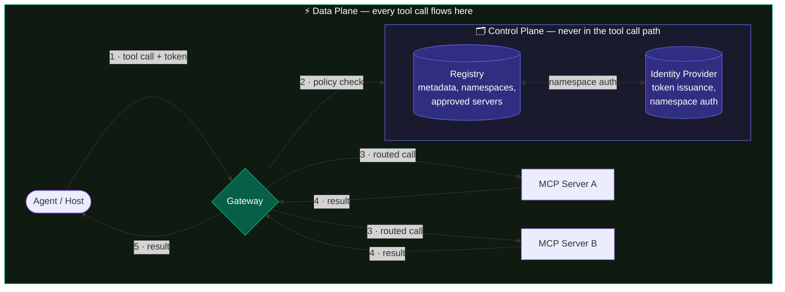
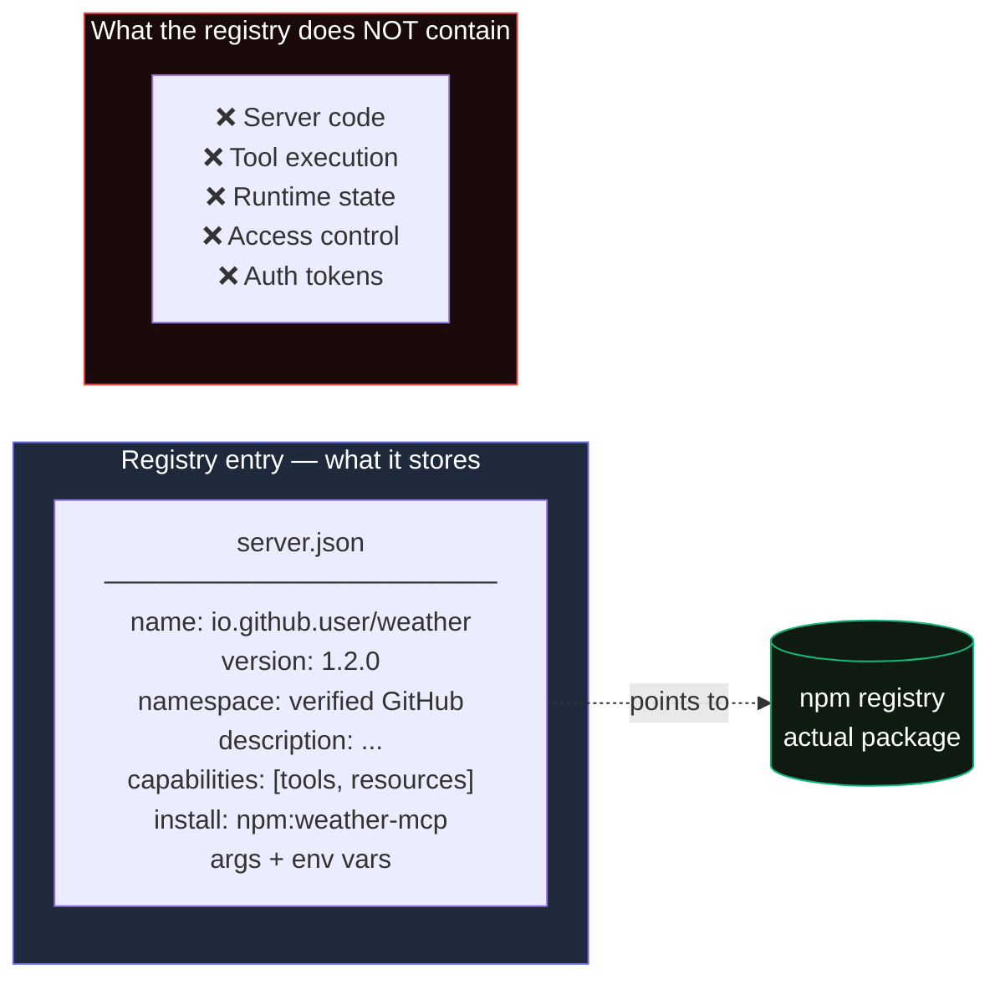
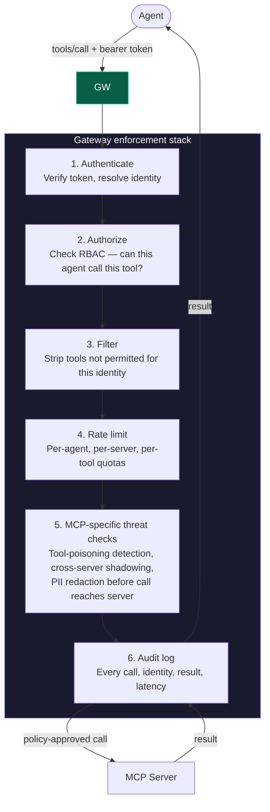

# Module 7 — Scaling Out: Registries & Gateways

Advanced

**Prerequisite:** Module 6 — When to Use MCP &nbsp;·&nbsp; **Mixed sourcing:** Registry is [official, preview]; Gateway pattern is [ecosystem]

---

## The problem this solves

You have one MCP server and one agent. Configuration is a config file. Governance is someone's memory.

You have fifty servers and twenty agents. Now configuration is a coordination problem, governance is a policy problem, and discovery is a search problem. That is when two infrastructure pieces become essential: a **registry** and a **gateway**.

They are not the same thing, and they are not interchangeable. They operate on different planes.

---

## Two planes

The most important concept in this module is the separation between two planes. Keeping them distinct in your head prevents a class of architectural mistakes.

The key observation: the registry never sees a tool call. It only stores metadata. The gateway sits in every call and enforces policy by querying the registry for access decisions.

| Plane | Component | Role | In the call path? |
|---|---|---|---|
| Control | **Registry** | Discovery — what servers exist, what they expose | No |
| Control | **Identity** | Namespace auth, token issuance | No (setup-time only) |
| Data | **Gateway** | Enforcement — auth, RBAC, rate limits, audit logging | Yes, always |

---

## The official MCP Registry

:::info[Status — preview as of June 2026]
The MCP Registry launched September 8, 2025 and remains **in preview**. The docs still read: "Breaking changes or data resets may occur before general availability." GA has not been announced. Plan accordingly if you are building tooling that depends on the API.
:::

The MCP Registry at [registry.modelcontextprotocol.io](https://registry.modelcontextprotocol.io) is a **metadata-only metaregistry**. It does not host code. It stores metadata that points to where code lives: npm, PyPI, Docker Hub.

### What a registry entry contains

Server metadata lives in a standardized `server.json` format. The key fields:

- **Unique name** using reverse-DNS namespacing: `io.github.username/server-name` or `com.example/server-name`
- **Location pointer**: an npm package name, Docker image, PyPI package, or remote URL
- **Execution instructions**: command-line args and required env vars
- **Discovery data**: description, server capabilities (tools, resources, prompts)

### Namespace authentication

Reverse-DNS naming is not just a convention. It is enforced. The registry uses namespace authentication to verify you actually own what you claim:

- `io.github.username/` requires a GitHub account challenge
- `com.example/` requires a DNS or HTTP challenge against that domain

This means only the legitimate owner of a GitHub account or domain can publish under that namespace. The schema is versioned and dated, and the format has not changed since the September 2025 launch.

### Who the registry is for

:::warning[Not for direct host consumption]
The registry is intended to be consumed by **downstream aggregators** (MCP marketplaces, curated catalogs), not directly by host applications. Host apps should consume aggregators that implement the registry's OpenAPI spec, not the registry itself.

The rationale: the registry is deliberately unopinionated metadata. Aggregators layer on curation, ratings, and additional security checks.
:::

The practical consequence for enterprise teams: do not build your internal tooling directly against the public registry API. Build a private sub-registry that implements the same OpenAPI spec. You get SDK and tooling compatibility with the public ecosystem while controlling your own server allowlist.

### Private enterprise sub-registries

The registry's OpenAPI spec is explicitly designed for this. A private sub-registry can:

- Combine public servers (from the upstream registry) with internal-only servers
- Apply custom approval workflows and access policies
- Expose the same REST API surface so existing host-app integrations work unchanged

Amazon's approach at scale: treat the registry as both a discovery catalog and a security classification layer. Their registry categorizes every server against what they call the "lethal trifecta": private data access, untrusted content exposure, and external communication. Servers get scanned for dangerous combinations before any agent configuration references them.

---

## The gateway

A gateway sits in the data plane between agents and MCP servers. It is MCP-native, meaning it understands MCP protocol messages, not just HTTP packets.

An HTTP reverse proxy routes requests. An MCP gateway understands what a `tools/call` is, who is calling it, which server owns that tool, and whether the calling agent is permitted to execute it.

The gateway is the single place IT governs access. It collapses the N-times-M wiring problem at the enforcement layer.

### What a mature gateway does

:::note[MCP-specific threat categories]
Mature gateways in 2026 defend against protocol-level risks that an API gateway does not cover. Three categories to know:

- **Tool poisoning**: a server returns a malicious tool description designed to hijack future tool selection
- **Cross-server shadowing**: a tool name in one server shadows a tool name in another, causing the agent to call the wrong one
- **Rug-pull**: a server changes its tool definitions between sessions, making prior authorization decisions stale

These require parsing MCP protocol messages, not just inspecting HTTP headers.
:::

### How the gateway and registry work together

The agent sends a tool call with a bearer token. The gateway:

1. Authenticates the token and resolves the calling identity
2. Queries the registry (or its own local cache of the registry) for which servers that identity may use
3. Checks whether the requested tool exists on one of those approved servers
4. Routes the call if permitted; returns a policy error if not
5. Logs the decision and the result

The agent never enumerates servers itself. Discovery is delegated to the gateway, which consults the registry. This is the "not either/or" point: the registry says what exists and is approved; the gateway controls who, how, and with what audit trail.

---

## Uber at scale: a concrete reference architecture

The most detailed public case study for enterprise MCP infrastructure comes from Uber, published by the Agentic AI Foundation in 2026.

Scale: 10,000-plus internal services, 5,000-plus engineers, 1,500-plus monthly active agents, 60,000 agent task executions per week.

The architecture centers on two components working in concert:

**Auto-translation gateway**: Instead of manually registering 10,000 services as MCP tools, Uber's gateway reads existing interface definition files (proto and Thrift) and uses an LLM to generate MCP tool descriptions automatically. New internal services become available to agents without any manual MCP registration step.

**Tiered trust model**: Internal MCP servers and third-party MCP servers receive different levels of scrutiny. The hard separation between tiers is enforced at the gateway, not left to individual agent configurations. This reflects organizational risk tolerance: internal services are already subject to Uber's security and compliance posture; third-party servers are not.

The identity layer extends an existing SPIRE deployment rather than building a parallel identity system. Authorization integrates with the existing authorization service. The lesson Uber drew: do not build a parallel governance stack for agents. Extend what already exists.

:::tip[The Uber lesson]
The pattern that scales is: auto-generate tool definitions from existing service contracts, enforce trust tiers at the gateway, and integrate identity and auth into existing organizational systems rather than creating agent-specific silos.
:::

---

## Enterprise registry and gateway products (June 2026)

The official registry covers the control plane for public server discovery. The gateway space is ecosystem practice with several production-ready options.

| Product | Best for | Key differentiator | License |
|---|---|---|---|
| **Obot** | Most enterprise teams wanting MCP governance without vendor lock-in | Purpose-built for MCP: curated catalog, composite servers, RBAC, IdP integration, GitOps-compatible admin | MIT (open source) |
| **TrueFoundry** | Teams consolidating MLOps and MCP governance | Named in 2025 Gartner Market Guide for AI Gateways; 3-4ms gateway latency; unifies model training, GPU orchestration, and MCP governance | Commercial |
| **Lunar.dev MCPX** | Risk-sensitive teams needing pre-production sandboxes | Pre-production sandboxes for hardening tool variants before deployment; MIT core | MIT / Commercial |
| **Kong Konnect** | Organizations already routing LLM traffic through Kong | Extends existing API governance patterns to MCP; consolidation play | Commercial |
| **AWS Bedrock AgentCore Gateway** | AWS-committed organizations | Fully managed; integrates with AWS Agent Registry (also preview); auto-registration via existing IAM | Commercial (AWS) |

:::note[Tyk]
The original source material cited Tyk. As of June 2026, Tyk does not appear in any current MCP gateway comparison or product announcement. It may have been referenced speculatively. Remove it from your vendor evaluation list until Tyk publishes MCP-specific documentation.
:::

**AWS Agent Registry** (separate from the official MCP Registry): a fully managed discovery service inside AWS that lets you publish MCP servers, tools, agents, and custom resources into a searchable catalog with approval workflows. It is also in preview. If your deployment is AWS-native, this is worth evaluating alongside the official MCP Registry's OpenAPI spec.

**Microsoft Azure API Center**: Microsoft added MCP server inventory and discovery to Azure API Center in 2026. If you are already using Azure API Center for REST API governance, MCP servers can be registered there with the same tooling.

---

## GitHub Copilot enterprise note

Org and enterprise admins can configure GitHub Copilot to use a specific MCP Registry URL with an access policy. This controls which MCP servers are discoverable by Copilot CLI and IDEs across the organization. The admin sets the registry endpoint; Copilot queries it at connection time. This is a direct application of the "host app consumes a registry that implements the OpenAPI spec" pattern described above.

See Module 9 for the cloud-agent exception, where Copilot agent mode bypasses the local host flow.

---

## Registry vs. gateway: not either/or

A common mistake is treating these as alternatives. They are complementary layers at different points in the architecture.

| Question | Answered by |
|---|---|
| What servers exist? | Registry |
| Is this server legitimate and from a trusted namespace? | Registry (namespace auth) |
| Can this agent use this server right now? | Gateway |
| What did this agent do, and when? | Gateway (audit log) |
| How do I build a private allowlist? | Private sub-registry (implements registry OpenAPI spec) |
| How do I enforce that allowlist at runtime? | Gateway (queries registry for policy decisions) |

You need both. The registry is the allowlist; the gateway enforces it.

---

## Takeaway

The registry is a metadata catalog on the control plane. It never sees a tool call. The gateway is enforcement on the data plane. It sees every tool call. Build private sub-registries on the official OpenAPI spec to get tooling compatibility with the public ecosystem. Deploy a gateway that is MCP-native (not just an HTTP proxy) to enforce policy, log decisions, and defend against protocol-level threats. The two work together: the gateway queries the registry for access decisions; neither is useful without the other.

---

## Sources

| Source | Type | URL |
|---|---|---|
| The MCP Registry — about / preview | **[official, preview]** | https://modelcontextprotocol.io/registry/about |
| MCP Blog, Introducing the MCP Registry (Sep 2025) | **[official]** | https://blog.modelcontextprotocol.io/posts/2025-09-08-mcp-registry-preview/ |
| Obot, The 13 Best MCP Gateways for Enterprise Teams (2026) | **[ecosystem]** | https://obot.ai/blog/the-13-best-mcp-gateways-for-enterprise-teams/ |
| AAIF, How Uber Runs 60,000 AI Agent Tasks Per Week With MCP | **[ecosystem]** | https://aaif.io/blog/how-uber-runs-60000-ai-agent-tasks-per-week-with-mcp/ |
| AAIF, MCP Is Now Enterprise Infrastructure — MCP Dev Summit NA 2026 | **[ecosystem]** | https://aaif.io/blog/mcp-is-now-enterprise-infrastructure-everything-that-happened-at-mcp-dev-summit-north-america-2026/ |
| TrueFoundry, MCP Gateway | **[ecosystem]** | https://www.truefoundry.com/mcp-gateway |
| AWS Bedrock AgentCore Gateway | **[ecosystem]** | https://docs.aws.amazon.com/bedrock-agentcore/latest/devguide/registry.html |
| Azure API Center — Inventory and Discover MCP Servers | **[ecosystem]** | https://learn.microsoft.com/en-us/azure/api-center/register-discover-mcp-server |
| Uber, Solving the Identity Crisis for AI Agents | **[ecosystem]** | https://www.uber.com/us/en/blog/solving-the-agent-identity-crisis/ |
| Teleport, Complicating factors of MCP in the enterprise | **[ecosystem]** | https://goteleport.com/blog/complicating-mcp-enterprise/ |
