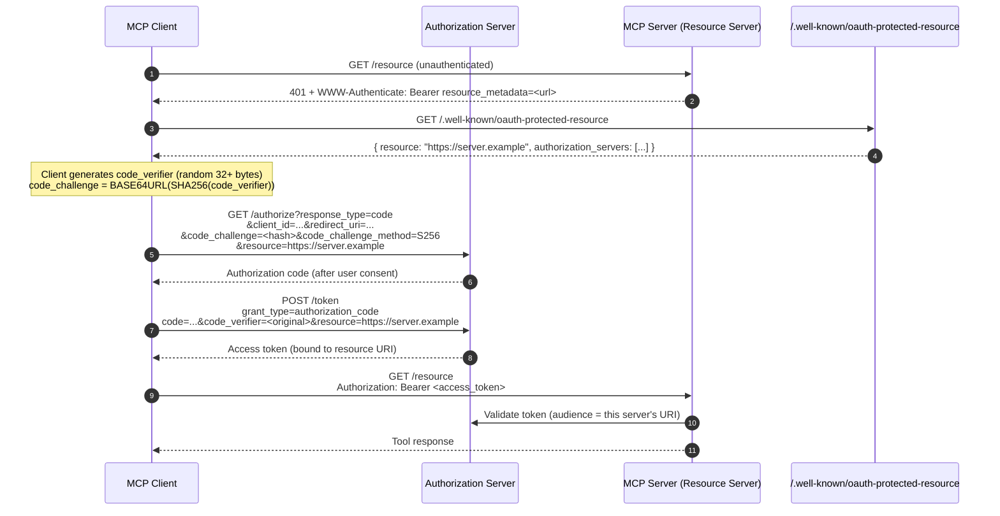
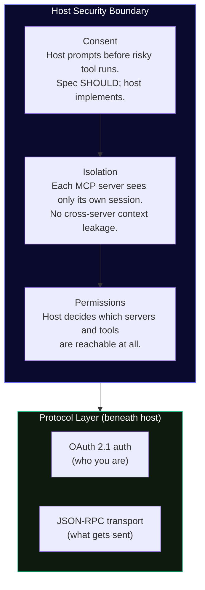

# Module 8 — Auth & Security

<span className="level-badge badge-advanced">Advanced</span>

**Prerequisite:** Module 7 — Registries &amp; Gateways &nbsp;·&nbsp; **Spec anchor:** [MCP 2025-11-25 · Authorization](https://modelcontextprotocol.io/specification/2025-11-25/basic/authorization) (normative)

---

## Two separate concerns

This module covers two things that get conflated constantly:

- **Auth**: proving who you are to an MCP server. This is an HTTP-layer concern. The protocol specifies exactly how it works. It is testable, normative, and has teeth.
- **Security**: controlling what the agent may do once it is connected. This is a **host-owned** concern. The protocol says what hosts *should* do. It is not wire-level enforceable.

Understanding which layer owns which guarantee is the foundation of every secure MCP deployment.

---

## Authorization (normative, MCP 2025-11-25)

### MCP servers are OAuth 2.1 resource servers

Authorization applies to **HTTP transports only.** STDIO servers SHOULD retrieve credentials from the environment; there is no OAuth flow for a local process.

Remote MCP servers that serve public or multi-tenant traffic MUST implement the full OAuth 2.1 authorization framework.

:::note[Spec scope]
The 2026-07-28 release candidate does not change the core auth framework. OAuth 2.1, PKCE/S256, RFC 8707, and RFC 9728 remain normative. The RC adds RFC 9207 (issuer identifier validation on authorization responses) to defend against mix-up attacks that are more common in MCP's one-client, many-server deployment pattern.
:::

### The full OAuth 2.1 / PKCE flow for MCP



**What is mandatory:**

| Requirement | RFC | MUST / SHOULD |
|---|---|---|
| PKCE with S256 code challenge | RFC 7636, OAuth 2.1 §4.1.1 | MUST |
| Resource Indicators (bind token to server URI) | RFC 8707 | MUST |
| Protected Resource Metadata discovery | RFC 9728 | MUST |
| Audience validation (token issued for this server) | RFC 8707 | MUST |
| OIDC or OAuth discovery endpoint on AS | RFC 8414 / OIDC | MUST |
| Issuer validation on auth response (RC 2026-07-28) | RFC 9207 | MUST (in RC) |

### Client registration: CIMD is the default

The spec defines a priority order for how a client establishes its identity with an authorization server.

1. **Pre-registration**: client was registered out of band.
2. **CIMD** (Client ID Metadata Documents): client presents a URL as its `client_id`; the AS fetches metadata from that URL. This is the preferred dynamic default. No stateful registration required on the AS.
3. **DCR** (RFC 7591 Dynamic Client Registration): stateful, AS-minted `client_id`. Retained for backward compatibility and for servers that want local credentials. Not the first choice.
4. **Interactive fallback**: prompt the user.

CIMD was formally incorporated as the preferred default in the 2025-11-25 specification. DCR is backward-compatible only.

### Token passthrough is forbidden

:::danger[Normative prohibition: no exceptions]
An MCP server MUST NOT forward a token it received from its client to any upstream API. If the server calls an upstream service on behalf of the user, it MUST obtain a separate token from that upstream service's authorization server.

Forwarding the inbound token breaks audience boundaries, bypasses access controls, weakens auditability, and can convert the MCP server into a transparent proxy for credential theft.
:::

```mermaid
graph TB
  subgraph wrong["❌  Token Passthrough — FORBIDDEN"]
    direction LR
    WC([Client]) -->|"Bearer token-A"| WS[MCP Server]
    WS -->|"Bearer token-A  ← SAME TOKEN"| WU[Upstream API]
  end

  subgraph right["✅  Correct Token Handling"]
    direction LR
    RC([Client]) -->|"Bearer token-A"| RS[MCP Server]
    RS -->|"Validate token-A\n(aud = this server)"| RAS[Auth Server]
    RAS -->>RS: valid
    RS -->|"Token exchange\n(OAuth delegation)"| RAS2[Upstream Auth Server]
    RAS2 -->>RS: token-B
    RS -->|"Bearer token-B"| RU[Upstream API]
  end

  style wrong fill:#1a0000,stroke:#ef4444,color:#fff
  style right fill:#0f1a0f,stroke:#10b981,color:#fff
```

### Persona vs identity

The **authenticated principal is always the end user** via your IdP. A persona or custom agent scopes which tools are reachable; it does not authenticate as an independent identity. The agent is a routing layer, not an identity.

---

## Security (host-owned)

Auth answers "who are you." Security answers "what may you do." The host owns this layer.

### The three host-level controls



The spec requires that:

- There SHOULD always be a human able to deny tool invocations.
- Clients SHOULD make clear which tools are exposed to the model.
- A server MUST NOT be able to read the full conversation or other servers' state.

### Local server install consent (SEP-1024, accepted)

Clients MUST require explicit user consent and command transparency before executing local-server install commands. This is a client-behavior rule, not a wire-protocol change.

### Confused-deputy defense

An MCP proxy using a static `client_id` for multiple downstream users MUST obtain per-user consent for each dynamically registered client. Without this, the proxy acts as a confused deputy, acting on behalf of user A using user B's permissions.

---

## The real risks

### Every tool is a potential execution path

Broad tools (shell access, unrestricted filesystem writes, unrestricted HTTP outbound) multiply the attack surface. The riskiest tools are the ones that chain: read a file, write to another service, execute a command.

### Prompt injection and tool poisoning (the lethal trifecta)

Tool output is data, not instructions. Never execute tool results. The worst-case scenario combines three elements:

1. **Private data** already in the agent's context.
2. **Untrusted content** arriving via a tool call (a document, a web page, an email).
3. **An exfil path**: another tool the agent can call to send data somewhere.

When all three are present, a single malicious document can instruct the agent to exfiltrate context to an attacker-controlled endpoint. This is the "lethal trifecta" named in the OWASP MCP Security Cheat Sheet.

### Confused deputy (agent-level)

The agent acts with the server's privileges on attacker-controlled input. If the server has write access to a production database and the agent processes user-supplied content without validation, the user controls what the agent writes.

### STDIO servers are local code execution

Installing a STDIO-based MCP server is functionally equivalent to installing a program and running it. The April 2026 OX Security disclosure (see below) confirms this threat model is not theoretical.

### Annotations are untrusted by default

A server can declare `readOnlyHint: true` in a tool definition and still delete files when called. Annotations are hints for UI display and risk labeling. They are not enforced by the protocol.

---

## The April 2026 STDIO RCE disclosure (OX Security)

:::danger[Unpatched at the protocol level, June 2026]
In April 2026, OX Security disclosed a systemic remote code execution vulnerability in Anthropic's MCP SDK affecting all officially supported languages (Python, TypeScript, Java, Rust). The STDIO transport executes any process command passed to it regardless of whether a valid MCP server initializes. This affects an estimated 200,000 vulnerable server instances and packages with 150M+ cumulative downloads.

**Anthropic's response:** The behavior is confirmed intentional. Anthropic declined to modify the protocol architecture, describing the execution model as "expected" and placing sanitization responsibility on downstream developers.

**Downstream patches:** Individual projects have issued fixes (LiteLLM patched via CVE-2026-30623 in v1.83.7-stable; CVE-2025-49596 for MCP Inspector; CVE-2026-22252 for LibreChat). The root cause remains unaddressed at the protocol level.

**What this means for practitioners:** Any STDIO-based MCP server should be treated as an untrusted executable. Vet server source before installing. Use sandboxing. Apply egress controls. Do not install STDIO servers from unverified registries.
:::

---

## Defenses (the supervision spectrum)

Apply these in layers. No single control is sufficient.

| Defense | Layer | Notes |
|---|---|---|
| **Least privilege** | Token + tool scope | Scope tokens to the minimum required capability. Narrow each tool's permissions. |
| **Schema validation before execution** | Server | Validate tool inputs against the declared JSON schema before any downstream call. Treat schema as a security boundary, not a correctness hint. |
| **Per-tool approval levels** | Host | Read-only tools auto-run. Risky tools (write, delete, shell) always prompt. Some tools denied entirely. |
| **Egress allowlists** | Infrastructure | Restrict what the MCP server can call outbound. Prevents exfil paths. |
| **URL validation (SSRF defense)** | Server | Validate any user-controlled URL against an allowlist before fetching. |
| **Sandboxing** | Infrastructure | Run STDIO servers in a process sandbox (containers, seccomp, restricted namespaces). |
| **Human in the loop** | Host | For any destructive or irreversible action, require explicit human approval at runtime. |
| **Ignore untrusted tool result instructions** | Agent | Tool output is data. An agent should never treat result text as instructions to execute. |

---

## GitHub Copilot security features

### Content exclusion

Content exclusion lets you hide files at repository, organization, or enterprise level from completions, chat, and code review.

:::danger[Critical gap: content exclusion does not cover Agent mode]
As of June 2026, content exclusion is **NOT supported** in:

- GitHub Copilot Agent mode (IDE)
- Copilot CLI
- Copilot cloud agents

Agentic workflows operate in isolated execution environments that do not inherit path-exclusion filters. Do not rely on content exclusion as a data protection control for any agentic Copilot workflow. GitHub has stated this limitation is known and being worked on, but it is unresolved as of this writing.
:::

### Push protection

Push protection blocks secrets in AI-generated responses for public repositories and GHAS-covered private repositories. This applies to Copilot suggestions and chat responses.

### Tool permissions in Copilot CLI

The `--available-tools`, `--allow-tool`, and `--deny-tool` flags constrain which tools the agent can call in a CLI session. Persisted approvals are stored in `permissions-config.json`. This is the correct per-session control to scope agent access.

---

## Enterprise-managed authorization (SEP-990)

The **Enterprise-Managed Authorization** extension (`io.modelcontextprotocol/enterprise-managed-authorization`) puts the enterprise IdP in the middle via an ID-JAG (Identity Assertion JWT Authorization Grant) token exchange. The enterprise IdP controls which MCP servers employees can reach and under what policy conditions: centralized SSO, centralized revocation, no per-server credential management.

**Status as of June 2026:** The extension is accepted and available at [modelcontextprotocol.io/extensions/auth/enterprise-managed-authorization](https://modelcontextprotocol.io/extensions/auth/enterprise-managed-authorization). SDK implementations are in progress (Python, Kotlin tracking issues open). No major SDK ships it complete yet.

:::warning[Security review finding]
An independent review by Doyensec flags that the ID-JAG consent model allows an LLM to autonomously request any policy-permitted scope. If policy permits a broad scope and the LLM requests it without human review, the human-in-the-loop guarantee is weakened for high-risk actions. Audit your policy scope definitions carefully before deploying this extension.
:::

---

## OWASP MCP Top 10

OWASP published the MCP Top 10 in 2025/2026 as the first MCP-specific risk catalog. The ten categories (current beta list):

| ID | Category |
|---|---|
| MCP01 | Token Mismanagement and Secret Exposure |
| MCP02 | Scope Creep |
| MCP03 | Tool Poisoning |
| MCP04 | Supply Chain Attacks and Dependency Tampering |
| MCP05 | Command Injection |
| MCP06 | Intent Flow Subversion |
| MCP07 | Insufficient Authentication and Authorization |
| MCP08 | Insufficient Logging and Monitoring |
| MCP09 | Shadow MCP Servers |
| MCP10 | Context Over-Sharing |

The OWASP MCP Security Cheat Sheet ([cheatsheetseries.owasp.org/cheatsheets/MCP_Security_Cheat_Sheet.html](https://cheatsheetseries.owasp.org/cheatsheets/MCP_Security_Cheat_Sheet.html)) is the primary practitioner reference for defensive implementation.

---

## Takeaway

Auth is a protocol-level concern: OAuth 2.1 resource server on HTTP, mandatory PKCE/S256, RFC 8707 audience binding, RFC 9728 Protected Resource Metadata discovery, CIMD-first registration, and an absolute prohibition on token passthrough. Security is a host-level concern: consent, isolation, per-tool permissions, schema validation, egress controls, and human-in-the-loop for irreversible actions. The persona scopes tools; the end user is the authenticated identity.

Two critical practitioner gotchas: GitHub Copilot content exclusion does not cover Agent mode, Copilot CLI, or cloud agents. Do not use it as an agentic data protection control. The April 2026 OX Security STDIO RCE disclosure remains unpatched at the protocol level; treat every STDIO server as an untrusted executable.

---

## Sources

| Source | Type | URL |
|---|---|---|
| MCP spec 2025-11-25 · Authorization | **[normative]** | https://modelcontextprotocol.io/specification/2025-11-25/basic/authorization |
| MCP 2026-07-28 Release Candidate | **[normative-RC]** | https://blog.modelcontextprotocol.io/posts/2026-07-28-release-candidate/ |
| MCP Enterprise-Managed Authorization extension (SEP-990) | **[official extension]** | https://modelcontextprotocol.io/extensions/auth/enterprise-managed-authorization |
| OWASP MCP Security Cheat Sheet | **[OWASP]** | https://cheatsheetseries.owasp.org/cheatsheets/MCP_Security_Cheat_Sheet.html |
| OWASP MCP Top 10 | **[OWASP]** | https://owasp.org/www-project-mcp-top-10/ |
| OWASP GenAI — Practical Guide for Secure MCP Server Development | **[OWASP]** | https://genai.owasp.org/resource/a-practical-guide-for-secure-mcp-server-development/ |
| OX Security — "The Mother of All AI Supply Chains" (April 2026) | **[research]** | https://www.ox.security/blog/the-mother-of-all-ai-supply-chains-critical-systemic-vulnerability-at-the-core-of-the-mcp/ |
| OX Security — MCP Supply Chain Advisory: RCE Vulnerabilities | **[research]** | https://www.ox.security/blog/mcp-supply-chain-advisory-rce-vulnerabilities-across-the-ai-ecosystem/ |
| CSA Research Note — MCP by Design RCE (April 2026) | **[research]** | https://labs.cloudsecurityalliance.org/research/csa-research-note-mcp-by-design-rce-ox-security-20260420-csa/ |
| LiteLLM — CVE-2026-30623 Security Update | **[official]** | https://docs.litellm.ai/blog/mcp-stdio-command-injection-april-2026 |
| GitHub Docs — Content exclusion for GitHub Copilot | **[official]** | https://docs.github.com/en/copilot/concepts/context/content-exclusion |
| GitHub Docs — About MCP (Copilot) | **[official]** | https://docs.github.com/en/copilot/concepts/context/mcp |
| Christian Schneider — Securing MCP: defense-first architecture | **[ecosystem]** | https://christian-schneider.net/blog/securing-mcp-defense-first-architecture/ |
| Auth0 — CIMD is the Future of MCP Client Registration | **[ecosystem]** | https://auth0.com/blog/cimd-vs-dcr-mcp-registration/ |
| Stack Overflow Blog — Authentication and authorization in MCP | **[ecosystem]** | https://stackoverflow.blog/2026/01/21/is-that-allowed-authentication-and-authorization-in-model-context-protocol/ |
