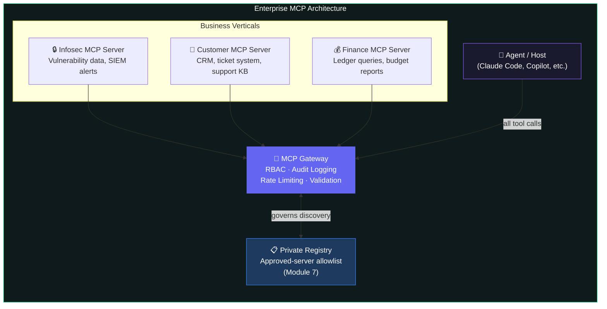
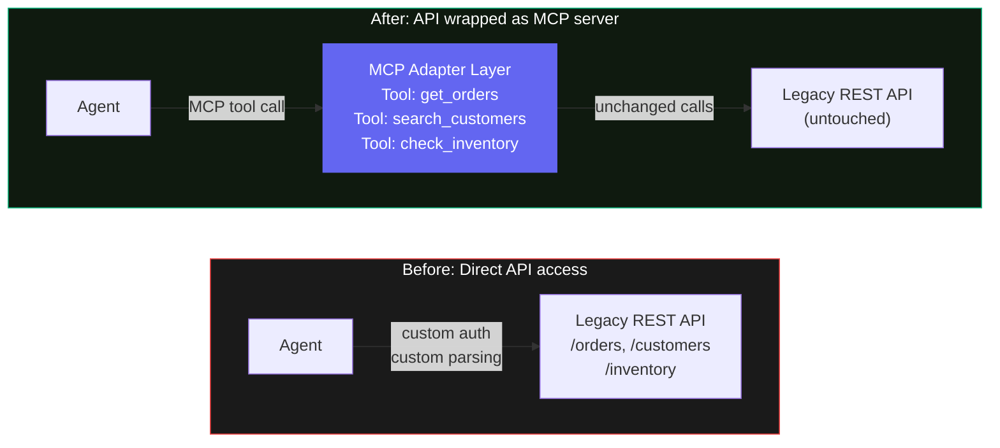
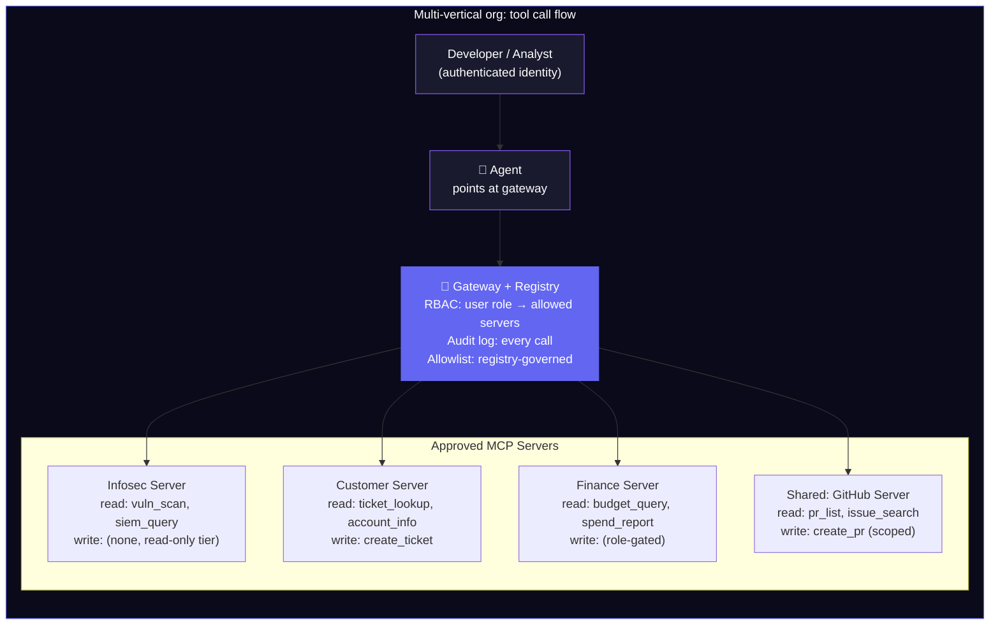
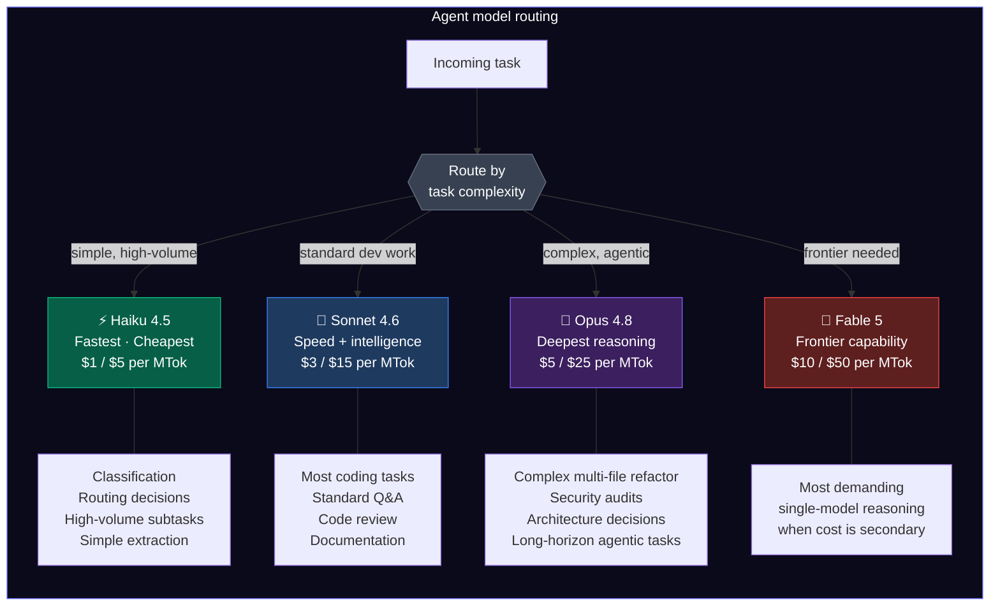

# Module 9 — Enterprise & Legacy Integration

<span className="level-badge badge-mastery">Mastery</span>

**Prerequisite:** Module 8 — Auth & Security &nbsp;·&nbsp; **Mixed sourcing:** Copilot specifics are [official]; gateway/legacy patterns are [ecosystem]

---

## What this module covers

Modules 1 through 8 built the foundation: what MCP is, how servers expose tools, how agents consume them, how registries govern discovery, and how auth secures the boundary. This module is the "how do I actually ship this at work" payoff.

Three concrete questions answered here:

1. How do large organizations run MCP at scale across multiple business verticals?
2. How do legacy and internal systems join an agentic stack without a rewrite?
3. How does GitHub Copilot's enterprise configuration actually work, and where are the scope limits?

---

## Enterprise governance: the gateway as control plane

At scale, the MCP gateway is not just a router. It is the control plane for every agentic tool call in the organization. [ecosystem]

The core functions:

- **RBAC by role and data sensitivity.** A read-only reporting agent never holds write permissions. Access is scoped at identity + tool level, not just at the server level.
- **Audit logging.** Every tool call is logged: identity, tool name, parameters, response, timestamp. This is the paper trail your security and compliance teams will ask for.
- **Rate limiting and input validation.** Gateways enforce per-identity and per-tool quotas and validate inputs before they reach the backend. This is the first line of defense against prompt injection reaching a production system.
- **Multi-layer defense.** Gateway controls, response redaction, and network-level controls operate independently. No single layer is the whole defense.

*Gateway vendors active in this space as of mid-2026: Obot, Tyk, TrueFoundry, Traefik, Kong, Speakeasy MCP Gateway.* [ecosystem]

### Enterprise maturity arc

Obot's enterprise MCP guidance describes a four-stage progression: [ecosystem]

| Stage | State | Characteristics |
|---|---|---|
| **1** | Shadow MCP adoption | Developers experimenting locally, no central visibility |
| **2** | Management pilot | IT takes ownership, curated catalog, basic access controls |
| **3** | MCP at scale | Enterprise-wide deployment, multi-MCP workflows in production |
| **4** | MCP fades into background | Invisible infrastructure, platform handles server and tool selection automatically |

The practical starting point for most organizations is Stage 1 to 2 transition: establish a private registry, apply the gateway, start with **read-only tools only**, and expand to write operations as trust and governance mature. Starting read-only reduces blast radius while the access and audit layers stabilize. [ecosystem, Obot]



Each vertical exposes its own MCP server with tools scoped to that domain. The gateway federates them with per-identity, per-role access. The agent points at the gateway, not at individual servers. The private registry is the approved-server allowlist that prevents unsanctioned servers from joining the network.

---

## Wrapping legacy APIs as MCP servers

This is the most common question from organizations with large existing system estates: "We have ten years of REST and SOAP services. Do we have to rewrite everything?"

The answer is no. The pattern is to **wrap the API as an MCP server**. [ecosystem]

The existing service is untouched. A thin adapter layer sits in front of it and presents the existing API surface as MCP tools. The adapter handles:

- Protocol translation (REST/gRPC/SOAP to MCP tool calls)
- Auth (transforming agent credentials into whatever the backend expects)
- Response parsing and schema mapping



### Generating the adapter from an OpenAPI spec

If the legacy API already has an OpenAPI spec, you do not write tool definitions by hand. Tools generate the MCP server from the spec. [ecosystem]

Primary tools as of June 2026:

| Tool | Language | Notes |
|---|---|---|
| **Stainless** | TypeScript | Free MCP generation alongside SDK; two-tool architecture (code executor + docs search); handles large/complex specs |
| **Speakeasy** | TypeScript | 50+ production servers generated; standalone MCP server generation; JQ filter support for response shaping |
| **FastMCP** | Python | Framework for building MCP servers; commonly used for custom adapters |
| **AWS Labs openapi-mcp-server** | Go | Open source; part of the AWS Labs MCP ecosystem |
| **IBM ContextForge** | Multiple | Enterprise-focused; SOAP and WSDL support alongside OpenAPI |

:::tip[Architecture choice: per-API server or gateway bridging]
For a small number of APIs, a standalone MCP server per API is simpler and easier to version independently. For a large estate or when centralized governance is required, a gateway that bridges multiple APIs at once scales better. Both patterns work. Choose based on your governance needs, not on theoretical elegance. [ecosystem]
:::

### For common SaaS systems

For Salesforce, SAP, Snowflake, and ServiceNow, the fastest path is a **managed connector** -- prebuilt, schema-validated, maintained by the vendor or community. Only build a custom adapter when no managed connector exists or the existing one does not expose the tools you need. [ecosystem]

---

## Multi-vertical organization example



Key points from this pattern:

- Each vertical owns its MCP server. Infosec does not share code or deployment with Finance.
- The gateway enforces role-based access. A customer support analyst cannot call Finance tools.
- The private registry is the allowlist. An unapproved server cannot join without registry addition.
- Audit logs at the gateway capture every call regardless of which vertical it targets.

---

## GitHub Copilot in the enterprise [official]

### Custom agents: `.agent.md` in `.github/agents/`

Custom agents are defined as `.agent.md` files. The format as of June 2026:

**File location by scope:**

| Scope | Location |
|---|---|
| Repository | `.github/agents/AGENT-NAME.agent.md` |
| Organization / Enterprise | `.github-private` repo, `/agents/AGENT-NAME.md` |

**YAML frontmatter fields:**

```yaml
name: "Optional display name"          # optional; filename used if omitted
description: "What this agent does"    # required
target: "github-copilot"               # vscode or github-copilot
model: claude-sonnet-4-6               # LLM to use for this agent
tools:                                 # omit = all tools; [] = no tools
  - github
  - code-review
mcp-servers:                           # additional MCP servers for this agent
  my-internal-api:
    type: http
    url: https://mcp.internal.example.com
disable-model-invocation: false        # true = agent requires manual selection
user-invocable: true                   # false = cannot be manually selected
metadata:                              # arbitrary annotation data
  team: platform-engineering
```

The agent's prompt and instructions go in the Markdown body below the frontmatter (maximum 30,000 characters).

:::note[Fields added since original launch]
`target`, `disable-model-invocation`, `user-invocable`, and `metadata` are additions to the schema. The `infer` field is retired -- use `disable-model-invocation` and `user-invocable` instead. The core fields (`name`, `description`, `tools`, `model`, `mcp-servers`) are unchanged.
:::

### Precedence: repo over org over enterprise

When an agent name exists at multiple levels, **repo takes precedence over org, org takes precedence over enterprise**. This mirrors the Copilot instructions precedence model. [official]

Agents are versioned by Git commit SHA. Rolling back is a `git revert`.

### Tool scoping matters for accuracy and security

The `tools` array is a key governance lever:

- **Omit** the field: all enabled toolsets are available to the agent.
- **Empty array** (`tools: []`): no tools are enabled.
- **Explicit list**: only the listed toolsets are available.

GitHub's documentation notes that **tool-selection accuracy improves with fewer enabled toolsets** -- both for security (reduced attack surface) and for model performance (less noise in the tool list). [official]

### The enterprise MCP registry scope limit

:::warning[Enterprise MCP registry does NOT govern the cloud agent]
This is the most commonly misunderstood scope boundary in Copilot MCP governance.

The enterprise MCP registry (configured on the Copilot policies page) and its allowlist controls apply to **Copilot CLI and IDEs only**. They do **not** apply to the Copilot cloud agent running on GitHub.com.

For the cloud agent, MCP servers are configured at the **repository level** (JSON config in repository settings) or in **custom agent profiles**. There is no registry-based allowlist for cloud agent MCP servers.

Design your governance model with this scope split in mind. Two separate control mechanisms. One for local surfaces (CLI, IDE), one for cloud surfaces (cloud agent). [official]
:::

---

## Backend models behind agents

MCP is provider-agnostic. The same MCP server works with any MCP client regardless of what model is running behind it. [official]

### Current Anthropic model IDs (June 2026)

| Model | API ID | Tier | Use case |
|---|---|---|---|
| **Claude Opus 4.8** | `claude-opus-4-8` | Complex | Deep reasoning, long-horizon agentic work, security audits |
| **Claude Sonnet 4.6** | `claude-sonnet-4-6` | Standard | Most coding tasks, standard agentic workflows |
| **Claude Haiku 4.5** | `claude-haiku-4-5-20251001` | Fast | High-volume subtasks, classification, routing decisions |
| Claude Fable 5 | `claude-fable-5` | Frontier | Most demanding reasoning; GA as of June 9, 2026 |

[official, platform.claude.com/docs/en/about-claude/models/overview]

:::note[Claude Fable 5 and Mythos 5]
Claude Fable 5 (`claude-fable-5`) became generally available June 9, 2026. Claude Mythos 5 (`claude-mythos-5`) is invitation-only through Project Glasswing. For most enterprise agentic workloads, Opus 4.8 and Sonnet 4.6 remain the practical choices. Fable 5 is positioned for the most demanding single-model reasoning tasks where cost is secondary.
:::

### Model tiering in practice



### Pinning a model per agent in Copilot

Use the `model:` frontmatter field in a `.agent.md` file to lock a specific model to a specific agent:

```yaml
model: claude-opus-4-8   # deep-analysis agent
```

```yaml
model: claude-haiku-4-5-20251001   # high-volume triage agent
```

Cost optimization in practice: route high-volume, simple tasks to Haiku; use Sonnet for the majority of developer-facing agents; reserve Opus for agents that require deep reasoning or long autonomous work sessions. [official for model IDs; tiering guidance is ecosystem-labeled]

### Provider-agnostic routing with Pydantic AI

Pydantic AI uses provider-prefixed model strings for provider-agnostic agent definitions:

```python
# Anthropic models
agent = Agent("anthropic:claude-opus-4-8")
agent = Agent("anthropic:claude-sonnet-4-6")
agent = Agent("anthropic:claude-haiku-4-5-20251001")

# OpenAI
agent = Agent("openai:gpt-5.2")

# Gateway routing (for internal LLM proxies)
agent = Agent("gateway/anthropic:claude-sonnet-4-6")
```

Pydantic AI resolves the provider prefix automatically, selecting the appropriate model class and HTTP client. The same agent definition works across providers by changing the string. Pydantic AI can also build and consume MCP servers via FastMCP integration. [official, ai.pydantic.dev]

---

## Day-to-day developer workflow

This is how the pieces connect in practice:

1. **Point your tool at servers** via its MCP config (Module 5). For Copilot, this is the `mcp-servers` frontmatter field or the repository JSON config.
2. **Let the host discover and inject tools** (Module 4). The agent sees tool names and descriptions, not the underlying API.
3. **Steer via instructions; constrain the tool set** (Modules 4, 5, 8). Fewer tools in scope means better selection accuracy and smaller attack surface.
4. **For internal systems: wrap the API as an MCP server** (this module). OpenAPI spec in hand, you can generate the adapter in hours, not weeks. The legacy system is untouched.
5. **Add the server to your private registry** (Module 7) so governance controls apply before any agent can discover it.

---

## Takeaway

At scale: a gateway is the control plane, a private registry is the approved-server allowlist, and legacy or internal systems join by being wrapped as MCP servers -- often generated directly from an OpenAPI spec with no rewrite of the original service.

Start read-only, harden the governance layers, centralize once you have more than a handful of tools. For Copilot, scope agents via the `tools` frontmatter field, understand the repo over org over enterprise precedence, and keep in mind that the enterprise MCP registry policy governs CLI and IDEs only -- it does not govern the cloud agent.

---

## Sources

| Source | Type | URL |
|---|---|---|
| GitHub Docs, About custom agents | **[official]** | https://docs.github.com/en/copilot/concepts/agents/cloud-agent/about-custom-agents |
| GitHub Docs, Custom agents configuration | **[official]** | https://docs.github.com/en/copilot/reference/custom-agents-configuration |
| GitHub Docs, About MCP (Copilot) | **[official]** | https://docs.github.com/en/copilot/concepts/context/mcp |
| GitHub Docs, Agent management for enterprises | **[official]** | https://docs.github.com/en/copilot/concepts/agents/enterprise-management |
| GitHub Docs, MCP and Copilot cloud agent | **[official]** | https://docs.github.com/en/copilot/concepts/agents/cloud-agent/mcp-and-cloud-agent |
| GitHub Changelog, Copilot CLI MCP allowlists (Apr 2026) | **[official]** | https://github.blog/changelog/2026-04-16-copilot-cli-supports-custom-registry-based-mcp-allowlists/ |
| Anthropic, Claude models overview | **[official]** | https://platform.claude.com/docs/en/about-claude/models/overview |
| Pydantic AI, Models overview | **[official]** | https://ai.pydantic.dev/models/overview/ |
| Stainless, Generate MCP servers from OpenAPI | **[ecosystem]** | https://www.stainless.com/docs/mcp/ |
| Speakeasy, Standalone MCP server generation | **[ecosystem]** | https://www.speakeasy.com/product/mcp-server |
| Obot, MCP Enterprise Architecture Reference Guide | **[ecosystem]** | https://obot.ai/blog/mcp-enterprise-architecture-reference-guide/ |
| Obot, MCP Management: What Comes After Building the Servers | **[ecosystem]** | https://obot.ai/blog/mcp-management-enterprise-guide/ |
