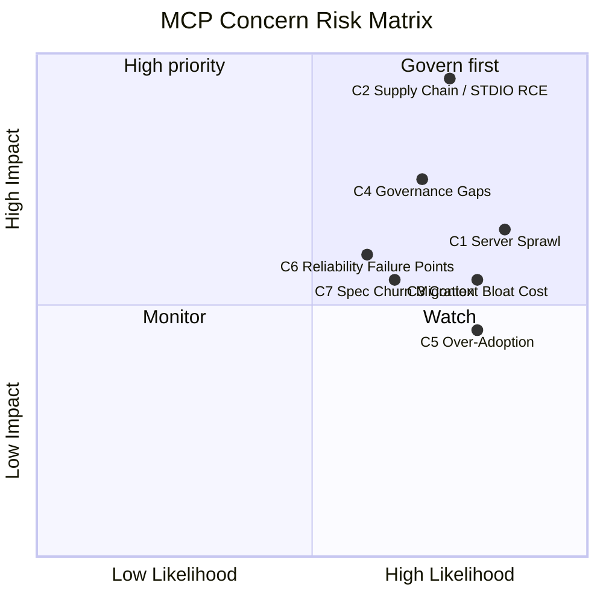
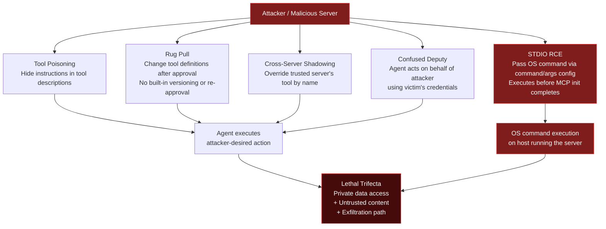
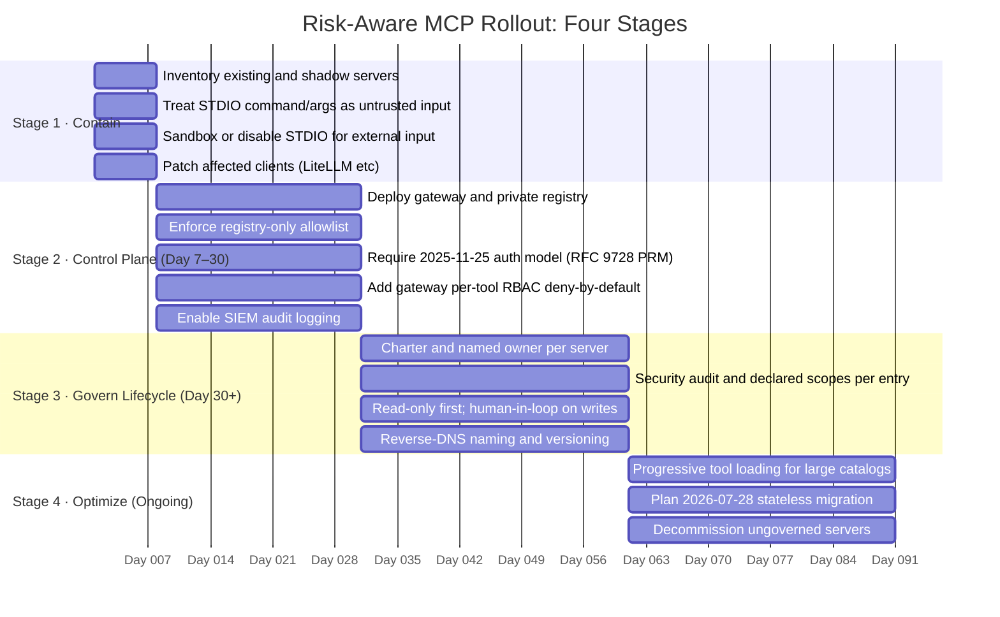

# Module 10 — Enterprise MCP Adoption: Concerns, Gotchas &amp; Rollout

Mastery

**Prerequisite:** Modules 7–9 &nbsp;·&nbsp; **Scope:** MCP server adoption — not agent orchestration

**Sourcing:** Security and spec claims are anchored to primary sources. Market and adoption statistics are flagged where they trace only to secondary coverage. Tags: **[normative]** spec, **[official]** vendor, **[ecosystem]** practitioner consensus, **[research]** named security/industry research, **[unverified]** secondary-source stat.

---

## The core tension

Enterprise MCP server success is real and measurable, but governance-dependent. The same property that makes servers valuable (any developer can stand one up in minutes and wire it to real systems) is exactly what makes them dangerous at scale. The dividing line between the success stories and the incident reports is whether a control plane (gateway + registry + managed auth) was in place *before* servers proliferated.

---

## The 7 concerns at a glance

The diagram below maps each concern by how likely you are to encounter it and how badly it can hurt when you do.

Read: **C2 (supply chain) sits in the high-impact, high-likelihood corner.** That is where to start.

---

## Concern 1: Server sprawl and shadow MCP

Servers are trivial to create, so teams build near-duplicate servers for the same API and never decommission old ones. Practitioners describe this as "the new microservices sprawl" and "the new shadow IT for AI."

By mid-2026 the pattern is documented at scale. A Gravitee survey found that only 24.4% of organizations have full visibility into which AI agents are communicating with each other. More than half of all agents run without any security oversight or logging. Unofficial directories already index 16,000+ open-source servers; the real count across GitHub is higher. **[ecosystem]**

The Qualys research team coined the term "Shadow MCP" for servers that operate outside formal security governance: unapproved, unsupervised, and typically unknown to the security function. Like shadow IT before them, they are rarely deployed with malicious intent. The typical origin is a developer experimenting, a data scientist building a prototype, or a research team that never decommissioned a test server. **[research]**

:::warning[Shadow MCP accumulates quietly]
Ninety-eight percent of organizations report unsanctioned AI use, and 49% expect shadow AI incidents within 12 months. The J.W. Pepper case study shows a realistic trajectory: finance teams building their own MCP servers, agents granted full admin access without review, and IT playing catch-up with no visibility into agent activity.
:::

**Why it matters:** every ungoverned server is an unaudited, credentialed integration point with no owner, no lifecycle, and no allowlist.

**Antidote:** an internal registry as a supply-chain allowlist. No server enters the catalog without a named owner, a security audit, and declared scopes (covered in Modules 7 and 9).

---

## Concern 2: Supply-chain and server security

This is the biggest concern. It has two distinct layers: structural weaknesses in the ecosystem today, and a specific critical vulnerability in the STDIO transport.

### The auth gap

Astrix Security analyzed 5,200+ open-source MCP servers and found that only **8.5% use OAuth**. Among the rest: 88% require credentials, 53% rely on long-lived static secrets such as API keys and PATs, and 79% of API keys are passed via plain environment variables. *Astrix Security, "State of MCP Server Security 2025" (Oct 2025).* **[research]**

This is the baseline. Most publicly available servers were not designed with enterprise use in mind.

### The STDIO RCE

:::danger[April 2026 STDIO RCE: not yet fixed at the protocol level]
OX Security disclosed in April 2026 that the official MCP SDKs pass user-controlled STDIO `command`/`args` config to OS execution without sanitization, and execute even when no valid server starts. The vulnerability affects an estimated 150 million downloads, more than 7,000 publicly accessible servers, and approximately 200,000 vulnerable instances across Python, TypeScript, Java, and Rust SDKs.

**Anthropic confirmed the behavior as intentional and declined to modify the protocol architecture.** Sanitization remains the downstream developer's responsibility.

OX Security identified more than thirty affected downstream projects. As of June 2026: LiteLLM, DocsGPT, Flowise, and Bisheng have shipped fixes. Windsurf, Langchain-Chatchat, GPT Researcher, and Agent Zero remain unpatched.

*OX Security, "The Mother of All AI Supply Chains" (Apr 2026); CVE-2026-30623 (LiteLLM); Cloud Security Alliance commentary.* **[research]**
:::

**The threat model for servers specifically:**

*OWASP MCP Top 10; OWASP MCP Security Cheat Sheet; Invariant Labs; OX Security.* **[OWASP/research]**

**Tool annotations are untrusted hints, not controls.** A malicious server can label a destructive tool `readOnlyHint: true`. *MCP spec 2025-11-25, Tools section.* **[normative]**

### Official guidance exists

NSA's Artificial Intelligence Security Center released a 17-page Cybersecurity Information Sheet on MCP security in May 2026. Key recommendations: align tools to data-classification zones, prefer local server instances for private data, validate every tool input against schema/range/context, and implement cryptographic message signing. *NSA, "Model Context Protocol (MCP): Security Design Considerations for AI-Driven Automation" (May 2026; document version U/OO/6030316-26).* **[official]**

OWASP publishes both the MCP Top 10 and a Security Cheat Sheet: sandbox local servers, never auto-approve tool calls, show full call parameters to users, treat tool output as untrusted data rather than instructions. *OWASP GenAI.* **[OWASP]**

Note: GSA requires MCP deployments to meet NSA security controls by September 30, 2026 for contracts over $250K. **[official, government]**

---

## Concern 3: Context-window bloat and FinOps

Tool definitions are injected into context on every turn and can dominate the window before any work begins. Anthropic has documented tool definitions consuming 100K+ tokens on a single turn. **[official]**

The mitigation is a server-design pattern: progressive disclosure (also called code-execution-with-MCP). Rather than exposing all tools upfront, the server exposes a small set of discovery and execution tools, and the model retrieves specific tool specs on demand. Anthropic reported cutting one workflow from 150,000 tokens to 2,000 tokens, a 98.7% reduction. *Anthropic, "Code execution with MCP" (Nov 2025).* **[official engineering pattern]**

**Why it matters for adoption:** large, monolithic servers exposing dozens of tools are an antipattern in two ways: they degrade tool-selection accuracy, and they inflate token cost per call. Prefer focused, single-domain servers. If you have a large catalog, design for lazy loading.

---

## Concern 4: Governance gaps in the protocol itself

The MCP protocol does **not** provide per-tool authorization, audit trails, or rate limiting. Those live in the gateway and registry layer, not the spec. The official 2026 roadmap names these as gaps. **[ecosystem, consistent with official roadmap]**

The Enterprise-Managed Authorization extension (SEP-990 / ID-JAG) is an accepted, opt-in extension, not core. It has documented security objections: Doyensec argues the JAG consent model relies on full user impersonation by a non-deterministic agent with no per-action consent. *modelcontextprotocol.io/extensions/auth/enterprise-managed-authorization; Doyensec, "MCP AuthN/Z Nightmare" (Mar 2026).* **[official extension + security review]**

**Takeaway:** do not assume the protocol secures or governs anything on its own. Governance is something you add.

---

## Concern 5: Over-adoption

The most common strategic mistake is reflexively wrapping every API as an MCP server. Practitioners are direct: "I tried to use MCP everywhere. That was a mistake." **[ecosystem]**

The decision rule from Module 6, sharpened:

| Situation | Use MCP server | Use direct API call |
|---|---|---|
| 3+ AI-connected integrations | Yes | |
| Provider-agnostic portability needed | Yes | |
| Central governance required | Yes | |
| Runtime-changing toolsets | Yes | |
| Deterministic, compliance-sensitive operation | | Yes |
| High-throughput pipeline, no AI | | Yes |
| Single fixed integration | | Yes |
| Nothing with AI in the loop | | Yes |

The complexity crossover point is roughly three integrations. Below that, a direct call is simpler, faster, and has fewer failure modes.

---

## Concern 6: Reliability and failure points

An MCP+model path has strictly more failure modes than a direct API call: the model may fail to call the tool, call the wrong tool, the server may error, the transport may fail, and the wrapped API may fail. **[ecosystem]**

For a single critical, deterministic call, the added hop and tool-selection step can reduce reliability. MCP earns its cost at integration scale, not at single-operation scale.

---

## Concern 7: Provisional spec churn

:::warning[2026-07-28 RC: sessions are removed from the protocol]
The release candidate locked May 21, 2026, scheduled to ship as stable on **July 28, 2026**, removes protocol-level sessions from the HTTP transport. This is the most significant protocol revision since launch.

**What specifically breaks for servers relying on session state today:**

- The `Mcp-Session-Id` header and the protocol-level session handshake are removed.
- Client metadata, capabilities, and protocol version now travel in the `_meta` field on every request.
- Two new required headers arrive: `Mcp-Method` and `Mcp-Name` on every Streamable HTTP request.
- Three first-class primitives are deprecated.

**Migration path:** removing the protocol session does not mean your application must be stateless. Servers that need to carry state across calls should mint an explicit handle (a `session_id`, a `basket_id`) as a tool return value and have the model pass it back as an ordinary argument on later calls. Treat load-balancer sticky sessions as a temporary bridge, not a permanent architecture.

*modelcontextprotocol.io blog, "The 2026-07-28 MCP Specification Release Candidate"; SEP-2567: Sessionless MCP.* **[normative-RC / provisional]**
:::

---

## Risk-aware rollout

The four stages below are sequenced to keep you safe while governance catches up to adoption.

**Stage 1: Contain (Days 0–7).** Inventory existing and shadow servers. Treat STDIO `command`/`args` as untrusted. Sandbox or disable STDIO where external input can reach model context. Patch affected clients.

**Stage 2: Control plane (Days 7–30).** Gateway and private registry as the allowlist. Enforce "registry only." Require the 2025-11-25 auth model (RFC 9728 Protected Resource Metadata, RFC 8707 audience validation, no token passthrough, PKCE/S256, Client ID Metadata Document over DCR). Add gateway per-tool RBAC with deny-by-default. Enable SIEM audit logging.

**Stage 3: Govern the lifecycle (Day 30 onward).** Charter plus named owner plus security audit plus declared scopes before catalog admission. Read-only first, human-in-the-loop on writes. Reverse-DNS naming, versioning, and deprecation policy.

**Stage 4: Optimize (ongoing).** Progressive tool loading for large catalogs. Plan the 2026-07-28 stateless migration now. Decommission ungoverned servers on a defined schedule.

---

## What success actually looks like

All three examples below governed servers through a platform layer before scaling. None succeeded by letting servers proliferate freely.

**Block (Goose):** As of early 2026, approximately 60% of Block's 12,000 employees use Goose weekly across 15 job functions. Employees report saving 50–75% of their time on common tasks; engineers specifically save 8–10 hours per week within the first month. All internal MCP servers are authored in-house for security; no public servers run in production. *Angie Jones / Block, "MCP in the Enterprise: Real-World Adoption at Block"; All Things Open coverage.* **[official]** (Secondary conference figures: treat as illustrative, not Block-official. **[unverified]**)

**Uber:** 60,000 agent executions per week and 1,500+ active agents monthly run through an internal MCP gateway and registry with PII redaction at the gateway. The gateway auto-translates Uber's 10,000+ service interface definitions (proto and thrift) into MCP tool descriptions. Over 90% of Uber's 5,000+ engineers use AI tooling monthly. *Agentic AI Foundation coverage of Uber's MCP Dev Summit 2026 talk; Uber engineering blog.* **[research / secondary conference coverage]**

**Atlassian Rovo MCP Server:** GA since February 2026, Atlassian-hosted, OAuth 2.1. At Team '26 (May 2026), Atlassian reported that more than 90% of its enterprise cloud customers are now using Rovo. Admin trusted-client controls and MCP usage logs are included for audit. *Atlassian, "Atlassian Rovo MCP Server is now GA"; Team '26 announcements.* **[official]**

---

## Misconceptions corrected

**"The protocol is secure and governed by default."** No. Security and governance are added at the gateway, registry, and IdP layer. The spec does not provide per-tool RBAC, audit trails, or rate limiting (Concern 4).

**"More tools and servers means more capability."** No. More tools degrade selection accuracy and inflate token cost. GitHub's own internal guidance recommends fewer, more focused tools for better selection.

**"Adoption statistics prove inevitability."** Many widely-quoted figures trace only to secondary and SEO-driven sources. Cite primary research (Astrix, Anthropic engineering, vendor blogs) and label the rest honestly.

**"Tool annotations are security controls."** No. A `readOnlyHint: true` annotation is advisory. A malicious server can lie. Defense lives at the gateway, not the annotation.

---

## Takeaway

Enterprise MCP server adoption succeeds when servers are treated as a privileged integration tier: governed by an allowlisting registry, a policy-enforcing gateway, IdP-managed OAuth, least-privilege scopes, audit logging, and a read-only-first rollout. The dominant failure modes are sprawl, supply-chain insecurity (zero-auth servers and the unpatched STDIO RCE), context bloat, and over-adoption. The supply chain concern is not theoretical: Anthropic has confirmed the STDIO execution behavior as intentional, leaving remediation with downstream developers, and dozens of projects remain unpatched as of June 2026.

If you would not give a microservice broad credentials without ownership, audit, and least privilege, do not give an MCP server them either.

---

## Sources

| Source | Type | URL |
|---|---|---|
| Astrix Security, "State of MCP Server Security 2025" (Oct 2025) | **[research]** | https://astrix.security/learn/blog/state-of-mcp-server-security-2025/ |
| OX Security, "The Mother of All AI Supply Chains" (Apr 2026) | **[research]** | https://www.ox.security/blog/the-mother-of-all-ai-supply-chains-critical-systemic-vulnerability-at-the-core-of-the-mcp/ |
| OX Security, Technical Deep Dive | **[research]** | https://www.ox.security/blog/mcp-supply-chain-advisory-rce-vulnerabilities-across-the-ai-ecosystem/ |
| Cloud Security Alliance, MCP by Design: RCE (Apr 2026) | **[research]** | https://labs.cloudsecurityalliance.org/research/csa-research-note-mcp-by-design-rce-ox-security-20260420-csa/ |
| LiteLLM, CVE-2026-30623 security update | **[official]** | https://docs.litellm.ai/blog/mcp-stdio-command-injection-april-2026 |
| NSA, "Model Context Protocol (MCP)" CSI, May 2026 | **[official]** | https://media.defense.gov/2026/Jun/02/2003943289/-1/-1/0/CSI_MCP_SECURITY.PDF |
| NSA press release | **[official]** | https://www.nsa.gov/Press-Room/Press-Releases-Statements/Press-Release-View/Article/4496698/ |
| Anthropic, "Code execution with MCP" (Nov 2025) | **[official]** | https://www.anthropic.com/engineering/code-execution-with-mcp |
| Block / Goose, "MCP in the Enterprise" (Angie Jones) | **[official]** | https://dev.to/goose_oss/mcp-in-the-enterprise-real-world-adoption-at-block-ci5 |
| Block at All Things Open (12,000 employees, 15 job functions) | **[official]** | https://allthingsopen.org/articles/block-scaled-mcp-12000-employees-15-job-functions |
| Uber MCP at scale (AAIF coverage) | **[research / secondary]** | https://aaif.io/blog/how-uber-runs-60000-ai-agent-tasks-per-week-with-mcp/ |
| Uber engineering blog, agent identity | **[official]** | https://www.uber.com/us/en/blog/solving-the-agent-identity-crisis/ |
| Atlassian Rovo MCP Server GA (Feb 2026) | **[official]** | https://www.atlassian.com/blog/announcements/atlassian-rovo-mcp-ga |
| Atlassian Team '26 Rovo update | **[official]** | https://www.atlassian.com/blog/company-news/rovo-team-26 |
| Doyensec, "MCP AuthN/Z Nightmare" (Mar 2026) | **[research]** | https://doyensec.com/resources/Doyensec_MCP_AuthNZ_Nightmare.pdf |
| MCP Enterprise-Managed Authorization extension | **[official]** | https://modelcontextprotocol.io/extensions/auth/enterprise-managed-authorization |
| MCP spec 2025-11-25, Authorization | **[normative]** | https://modelcontextprotocol.io/specification/2025-11-25/basic/authorization |
| MCP spec 2025-11-25, Tools (annotations) | **[normative]** | https://modelcontextprotocol.io/specification/2025-11-25/server/tools |
| 2026-07-28 RC blog post | **[normative-RC / provisional]** | https://blog.modelcontextprotocol.io/posts/2026-07-28-release-candidate/ |
| SEP-2567: Sessionless MCP | **[normative-RC]** | https://modelcontextprotocol.io/seps/2567-sessionless-mcp |
| OWASP GenAI / MCP Top 10 and Security Cheat Sheet | **[OWASP]** | https://genai.owasp.org |
| Qualys, "MCP Servers: The New Shadow IT" (Mar 2026) | **[research]** | https://blog.qualys.com/product-tech/2026/03/19/mcp-servers-shadow-it-ai-qualys-totalai-2026 |
| NimbleBrain, "State of MCP Security" (Mar 2026) | **[ecosystem]** | https://nimblebrain.ai/blog/state-of-mcp-security-2026/ |
| GitHub Docs, MCP allowlist enforcement | **[official]** | https://docs.github.com/en/enterprise-cloud@latest/copilot/reference/mcp-allowlist-enforcement |
| AAIF, "MCP Is Now Enterprise Infrastructure" (MCP Dev Summit 2026) | **[ecosystem]** | https://aaif.io/blog/mcp-is-now-enterprise-infrastructure-everything-that-happened-at-mcp-dev-summit-north-america-2026/ |
| dev.to evanlausier, "MCP Servers Are the New Microservices Sprawl" | **[ecosystem]** | https://dev.to/evanlausier/mcp-servers-are-the-new-microservices-sprawl-and-were-making-all-the-same-mistakes-4mmm |
